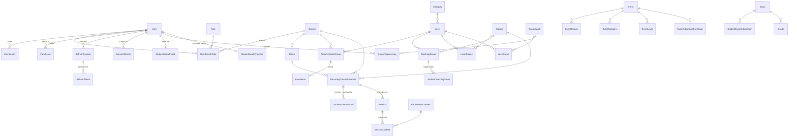

[Documentation](../README.md) › [Architecture](README.md) › **Database**

# Database

PostgreSQL 18.4, accessed through Prisma 7.9. The database is not a passive store here — it
carries a meaningful share of the system's invariants, and several of them **cannot be
expressed in Prisma's schema language at all**.

## The entity model



Plus the platform-level tables: `AuditLog`, `Trash`, `SystemSetting`, `AcademicYear`,
`EducationalContent`, `ConsumedToken`, `RateLimitCounter`, and `HijriMonthStart`.

> The authoritative field-by-field definition is SRS §7. This page explains the parts that
> are non-obvious.

## Entities that carry a design decision

### `User` — one table, several kinds of person

Staff, parents, adult students, and minors are all `User` rows. What differs is what hangs
off them.

| Column | Why it exists |
|---|---|
| `account_status` | The lifecycle: pending → active → suspended, with rejected terminal. Separate from a per-branch `user_status` |
| `sex` | The **person-side half** of the level's `gender_restriction`. Without it the restriction is unenforceable — nothing could compare a person against a girls-only level. Captured **at registration**, in the same transaction that creates the person, because the registration exists before the `User` does |
| `pre_provisioned_email` | The address authorized to claim this account **before any external identity exists**. Unique among non-null values. **Retained after binding**, never cleared, so provenance survives and the address cannot be claimed twice |
| `public_display_name` | An optional name the person chooses to publish. Distinct from `nickname`, which is an internal search convenience — this is a publication choice |
| `version` | Optimistic locking on staff edits |

### `UserIdentity` — completed bindings only

Keyed by `(provider, provider_subject_id)`, unique. MVP has one provider: Google.

**Placeholder rows are prohibited.** A row with a null, empty, or synthetic subject id
standing in for an unbound account would make *"has an identity"* stop meaning *"has
authenticated"* — and that predicate is what the entire login routing rests on. An account
awaiting its first binding is represented by `pre_provisioned_email` and nothing else.

### `NormalizedEmailLock` — synchronization, not ownership

`User.pre_provisioned_email` and active `UserIdentity.email` are separate representations of
one normalized-address claim. Their indexes cannot constrain one another and cannot lock an
address absent from both tables. `NormalizedEmailLock(email, created_at)` supplies one stable
row per address for the production ownership writers to lock before deciding.

It deliberately has no User foreign key. Adding one would make it a third ownership record
that could disagree with the two SRS fields; deleting it on account lifecycle changes would
also reopen the race. Rows may therefore outlive an active claim and remain harmless lock
targets. The availability decision always comes from an under-lock re-read of the actual
ownership channels.

### `UserBranchRole` — the whole authorization model

Unique on `(user_id, role_id, branch_id)`, so one person may hold the same role once per
branch. **`branch_id IS NULL` means all branches for that assignment** — not "Super Admin".
Super Admin's bypass follows from its role.

### `RefreshSession` and `RefreshToken` — one stable chain, rotating generations

Rotation, revocation, the grace window, and revoke-on-suspension all need per-token server
state that no other entity holds.

`RefreshSession` is deliberately only `(id, user_id, created_at)`: it is the stable row locked
by refresh, logout, revoke-all and `token.purge`, not another credential or revocation source.
Token generations cannot fill that role at `READ COMMITTED`: rotation may insert a successor
outside a lock statement's snapshot and purge may delete the predecessor on which a waiter was
queued. The anchor is removed only when purge, while holding it, finds no token generation left.
PostgreSQL advisory locks were rejected because §16.2 permits repository raw SQL for row locks,
and a UUID cannot be represented by PostgreSQL's 64-bit advisory key without collision.

The anchor is intentionally session-scoped, not user-scoped. The already-stable `User` row is
the higher-level lock for the two operations that must govern anchors which do not exist yet:
identity binding, new login/session creation, current-role credential decisions and user-wide
revocation, including Pending → Rejected. Their order is User first, then existing
`RefreshSession` ids in UUID order. The
explicit User mode is `FOR NO KEY UPDATE`: `User.id` is immutable, while all protected status,
deletion and role decisions still conflict with this lock. A successful login re-reads status
and assignments while holding it; rejection and suspension hold it while changing status and
enumerating/revoking all anchors. The shared session issuer independently re-checks that the
account is Active or Pending under this lock, so a helper call cannot bypass that boundary.

Refresh, logout and purge never request that **explicit** User lock. Refresh-token and audit
inserts can nevertheless acquire an **implicit `KEY SHARE`** on the referenced User during FK
validation. That real database edge is why `FOR NO KEY UPDATE` matters: it is compatible with
`KEY SHARE`, whereas `FOR UPDATE` allowed a refresh/logout holding a session anchor to wait on
User while suspension holding User waited on that same anchor. Session-first operations now
finish their FK write and release the anchor without weakening User-wide serialization.

| Field | Consumer |
|---|---|
| `token_hash` | **Hashed, never raw** — a stolen database dump must not yield usable 30-day credentials. Unique |
| `session_id` | The stable id of one rotation chain. Makes "revoke this session" a single indexed `UPDATE` instead of a recursive walk of predecessors |
| `rotated_from_id` | The immediate predecessor. **This one field decides all three refresh outcomes**: current → rotate, immediate predecessor within grace → accept, anything older → reuse detected |
| `revoked_at` / `revoked_reason` | The revocation check is `revoked_at IS NULL`. The reason separates a normal logout, detected replay, suspension, R102 rejection, deletion, and R101's one-time cookie-Path rollout; NULL remains reserved for ordinary rotation |

The fields **deliberately excluded** are documented in the specification with their reasons,
so a later implementer does not re-add them by reflex: `created_at` (identical to
`issued_at`), `revoked_by` (duplicates the audit actor, and two actor records will
eventually disagree), `created_by_ip` and `user_agent_hash` (personal data on a population
including minors, with no consumer and no retention rule), `last_used_at` (under mandatory
rotation a token is used exactly once).

### `HijriMonthStart` — the calendar's sole source

One row per Hijri month: year, month, the Gregorian date it officially began, and a status
of `draft | published`. **Only published months render anywhere**, so a year can be entered
progressively and reviewed first.

`source` records provenance on the row — `manual` today, an importer's identifier if one is
ever added — so the two are distinguishable without a schema change. Every write goes
through one service method, which is what makes a future importer inherit its ordering rule,
locking, draft state, and audit trail rather than reimplementing them.

> [Calendar and Hijri](calendar-and-hijri.md)

### `StudentSurahProgress` — a cache that cannot go stale

Coverage percentage plus the merged interval set, keyed by `(student_id, surah_id)`,
carrying `last_log_id` / `last_log_at` stamps of the newest governing log.

**It is never the source of truth — the logs are.** Every consumer compares the stamp
against the student+surah's latest log (a cheap indexed max) and, on mismatch, recomputes
from the logs and repairs the row in place *before* using the value. That makes a stale read
structurally impossible, including after a crash between the log commit and the cache
upsert.

**List pages run the guard as one joined query** — cache rows left-joined against each
pair's latest log id — never as per-row cache reads plus per-row max lookups, which would be
an N+1 wearing a cache costume.

### `SessionRecording` → `EducationalContent` — a nullable UNIQUE that is the whole idempotency design (R99)

One column, `session_recording.educational_content_id`: **nullable, unique, FK `RESTRICT`** —
an optional 1:1. Each half is load-bearing.

**Nullable**, because most of a recording's life is spent before there is anything to point at:
it is `NULL` while capturing, while the provider finalises, and while the import job runs.

**Unique**, because a provider may deliver the same completion twice, a pg-boss job may be
retried, and a worker may be killed between the server-side copy and the row write. All three
must converge on **one** `EducationalContent`. The ingestion job reads this column first and
returns the existing result when it is set — and the unique index is what makes that check hold
under concurrency rather than merely usually.

**`RESTRICT`**, because deleting the library item must not silently erase the record that a
class was recorded. The link is severed deliberately or not at all.

**And it is why there is no `available` status value.** *«متاح»* is exactly
`educational_content_id IS NOT NULL`. A status enum carrying `available` would be a second fact
about the same thing, and the two can disagree — the disagreement looking like a working library
item whose object is absent, which R99.14 calls worse than an honest failure. **Derive the
state from the row that proves it.**

`ingestion_failure_reason` sits beside it and is deliberately **not** the same column as
`failure_reason`: the provider failing to record and the platform failing to accept what it
recorded are different events with different remedies, and only the second is fixed by retrying.

### `ConsentRecord` and `AuditLog` — append-only by design

Consent is a **state-change history**, never overwritten. Effective status is always
derived from the most recent record, and absence means no consent.

`AuditLog.actor_user_id` is **nullable**, and a null means *system-initiated*, not
*attribution lost*. Two mandated actions genuinely have no human actor: replay-detected
session revocation (triggered by an unauthenticated request presenting a stolen secret) and
the consent job's forced visibility changes.

## Constraints the application layer cannot be trusted with

### Uniqueness

| Constraint | Guards |
|---|---|
| `UserIdentity (provider, provider_subject_id)` | One external identity, one account |
| `UserIdentity (provider, email)` among active | Case variants cannot become distinct identities |
| `ConsumedToken (jti)` | **The onboarding-token replay guard.** A replay hits this violation, the transaction aborts, and the request fails — enforcement is mechanical, not aspirational |
| `FamilyLink (student_id, parent_id)` **where not deleted** | A revoked link can be requested again later |
| `AcademicYear` exactly one `is_current` | Partial unique index |
| `RateLimitCounter (user_id, bucket, window_start)` | What makes the increment safe under concurrency |
| `User.pre_provisioned_email` among non-null | Two accounts must never claim one address, or a first login is ambiguous about which it binds |
| `NormalizedEmailLock.email` | One collision-free transaction boundary across pre-provisioned and completed identity ownership, including absent-row creation |
| `RefreshToken.token_hash` | Makes "presented token → exactly one row" a lookup, not a scan |
| `RefreshToken.session_id → RefreshSession.id` | Every generation has one stable, database-enforced serialization target |
| `Enrollment (student_id, level_id)` **where not deleted** | **Exactly one organisational group per enrolled level** (BR-21). Only expressible because `level_id` sits on the enrolment row — see below |
| `AdministrativeGroup (id, level_id)` | Redundant against the primary key **on purpose**: PostgreSQL requires a unique constraint on the referenced pair before `Enrollment` can declare its composite foreign key |
| `StudentTeachingGroup` — at most one per `(student, subject, level)` **where not deleted** | At most one split-group per subject (BR-22). `subject` and `level` come from the teaching group, so this is a **functional** index over the join, hand-written |
| `Session (schedule_id, date)` | What makes `session.materialize` idempotent — a second run creates no duplicate occurrence |

#### The composite foreign key on `Enrollment`

`Enrollment` carries `level_id` **as well as** `administrative_group_id`, which looks like
duplication and is not. A composite foreign key
`(administrative_group_id, level_id) → AdministrativeGroup(id, level_id)` makes the database
**refuse** a row whose level disagrees with its group's.

That is the whole point. The invariant "exactly one group per enrolled level" spans two
hops, and a plain unique index cannot express it. The alternatives were a trigger or a
service-layer check — both of which can be bypassed and neither of which the database
enforces. With the composite FK the redundant column is a *constraint*, not a copy, so
there is no second source of truth to drift.

**Never drop this FK to "simplify" the schema.** Removing it turns `Enrollment.level_id`
into exactly the kind of copy that the platform has been burned by before.

### Checks

- `QuranProgressLog`: `start_ayah >= 1 AND start_ayah <= end_ayah`. The upper bound against
  the Surah's total crosses tables, so it is a **trigger** plus a service check.
- All stored scores: `>= 0 AND <= 10000`. **No float score column exists anywhere.**
- `display_order >= 0`; `RecurringCourseSchedule.start_time < end_time`;
  `Session.start_time < end_time`; `Room.capacity > 0` **when present — a shape check only,
  because nothing compares a roster against it** (BR-23).
- `RecurringCourseSchedule`: **exactly one target FK is non-null and it matches
  `teaching_mode`.** A mode without its target, or a target without its mode, is a schedule
  nothing can resolve a roster for. Also `recurrence <> 'none'` — a non-recurring occurrence
  is an Event, not a schedule.
- `AcademicYear.label` matches `^\d{4}-\d{4}$`.
- `HijriMonthStart`: month 1–12; year 1300–1600 (brackets any date this platform will render
  while rejecting a mistyped Gregorian year); **two months of one year may not share a start
  date, and month *n+1* must start after month *n*** — an out-of-order pair would make date
  resolution ambiguous.
- `CHECK (email = lower(email))` on both email columns. The application lowercases on every
  write; **this is the backstop**, so a single unlowered code path — a form, an import — can
  never create a case variant that slips past the unique index.

## Arabic collation

The single `name` column on Branch, Category, Level, and Subject, plus sortable person-name
columns, are **natively collated `ar-x-icu` at the column level**.

This matters more than it sounds. Default `C`/`en_US` collation sorts Arabic by codepoint
and produces orderings that look wrong to every user. Collating the column means sorting is
correct **by default, in every query**, with no per-query `COLLATE` clause anywhere.

> **Never add a per-query `COLLATE` workaround. Fix the column.**
> [`BR-19`](../reference/business-rules.md#br-19) · [Internationalization](internationalization.md)

## Search

Substring matching, not prefix-only and not whole-word — `سعاد` matches `أم سعاد`. Minimum
query length 2, case-insensitive.

**Normalization is applied identically to the query and the stored value:** strip tashkeel
and tatweel, fold أإآ→ا, ة→ه, ى→ي; lowercase and fold Latin accents for French names; strip
spaces and `+` from phone numbers.

The implementation matters: each searchable column is paired with a **generated normalized
shadow column**, indexed, and queried with `ILIKE '%…%'` against the shadow. Normalization
is **never** applied per row at query time — that would defeat every index.

**No fuzzy matching in the MVP.** No trigram similarity, no Levenshtein, no search engine.
Paper-roster spelling variance is absorbed by the normalization rules, which collapse the
dominant variant classes; genuine misspellings are a data-entry problem, not a
search-engine problem. Revisiting this is an explicit decision, not an implementer's
initiative.

## A model with no `@@map` silently targets a different table

Every table on this project is `snake_case` and every Prisma model is
`PascalCase`, so **the mapping is what connects them**. Drop `@@map("exam")`
while editing a model and Prisma does not complain: it generates a client that
queries `"Exam"`, a table that does not exist, and the schema still *validates*
because a mapping is optional.

The failure surfaces far from the cause — `The table public.Exam does not exist`
from whatever runs first, which reads as an unapplied migration. It cost a slice
here: R58's model block was rewritten by hand after `prisma format` mangled it,
and the rewrite lost the `@@map` **and** the `@@index`. The migration was correct
and applied; the endpoints were unreachable anyway.

Two habits, both cheap:

* **Rewriting a model block means re-checking its trailing `@@` lines** — they
  sit at the bottom, which is exactly where a hand-written replacement stops.
* **Run something that touches the table before believing the model.** A
  typecheck cannot see this; one integration test can. It is the general rule of
  [measure, don't infer](../development/engineering-efficiency.md) in its
  cheapest form.

## Migrations

### Hand-written SQL

Prisma **cannot declare** custom collations, CHECK constraints, partial or functional unique
indexes, or triggers. An agent that writes them into `schema.prisma` will fail to compile
or — worse — silently drop the validation.

The mandatory workflow:

1. Model tables, columns, enums, FKs, and plain unique indexes in `schema.prisma` normally.
2. For every PostgreSQL-specific element, run **`prisma migrate dev --create-only`** and
   **hand-write the SQL** into the generated file before applying.
3. The very first hand-written migration **registers the collation explicitly**:
   ```sql
   CREATE COLLATION IF NOT EXISTS "ar-x-icu" (provider = icu, locale = 'ar', deterministic = true);
   ```
   Not relying on it being predefined is what makes the migration history self-contained and
   portable.
4. **`prisma db push` is prohibited in every environment** — it bypasses the history and
   silently drops the hand-written SQL. CI enforces this.

### Compatibility policy

- **Forward-only in production.** Down-migrations are never written or run. Rollback means
  restoring the pre-deployment backup.
- **Migrations preserve data — always.** A migration that loses rows is a defect regardless
  of what it enables. Every deployment takes a `pg_dump` **immediately before** applying
  migrations, so the rollback point matches the pre-migration state exactly.
- **Destructive operations follow expand–migrate–contract.** Dropping a column, or
  tightening a constraint on populated data, is permitted only as the final *contract* step
  of a three-phase sequence, with the drop in a **separate, later migration** after no
  released code references the old structure. A single migration that adds and drops is
  prohibited.
- **No direct renames.** Prisma renders a naive rename as DROP + ADD, which destroys data.
  A rename is expand–migrate–contract.
- **New NOT NULL columns** on populated tables ship with a default or an in-migration
  backfill.
- **Every migration is rehearsed** against ceiling-scale fixtures. Duration matters: an
  `ALTER` rewriting a million audit rows must be known about beforehand, not discovered
  during a deploy window.

CI enforces the append-only history, the `db push` ban, the presence of the hand-written
SQL, and flags every `DROP`/`RENAME` for human review with its contract-phase justification.

### Current migration history

```
20260724194811_init_schema
20260724210945_add_rate_limit_counter
20260724222514_add_pre_provisioned_email
20260725123714_add_refresh_token
20260728132320_add_user_sex_and_generic_categories
20260728222630_r31_hijri_month_start
20260728222900_r31_hijri_month_start_checks
20260728223400_r31_remove_hijri_day_offset
20260729045246_r35_branch_public_contact_fields
20260729045400_r35_branch_public_field_checks
20260729060000_r36_1_display_name_not_blank
20260729150624_r36_1_public_display_name
20260801194116_r39_user_intended_branch
20260802131723_r40_arabic_name_parts
20260802135318_r41_french_name_parts
20260804101500_r43_educational_model_expand
20260804101600_r43_educational_model_constraints
20260804180000_r43_4_session_staff_snapshot
20260804200000_r43_contract_drop_retired_model
20260805190000_r49_requested_role
20260805200000_r49_intended_category
20260805210000_r50_effective_until
20260809120000_r57_schedule_title
20260809180000_r58_exam_mode
20260809190000_r58_exam_branch_date_index
20260811120000_r62_child_applications
20260811180000_r64_child_application_branch
20260811210000_r66_enrollment_branch
20260812090000_r68_identity_review
20260812150000_r71_event_staff
20260812170000_r73_quran_subject_marker
20260818120000_r77_session_cancellation_notification
20260818160000_r78_assignment_and_reschedule_events
20260818200000_r79_beneficiary_fact
20260818220000_r80_sex_not_null
20260819000000_r81_exam_max_grade
20260819120000_r82_notification_targets
20260819160000_r83_optional_reason
20260819200000_r88_teaching_profile
20260819230000_r91_effective_staffing
20260820010000_r92_session_audience_branch
20260820120000_r93_event_staff_assigned
20260820160000_r96_user_qr_identity
20260820180000_r97_delivery_mode
20260821090000_r99_recording
20260821140000_r99_recording_ingestion
20260821200000_r101_refresh_cookie_path_reason
20260821200100_r101_invalidate_legacy_refresh_sessions
20260823100000_r101_refresh_session_anchor
20260823190000_r102_rejection_revocation_reason
20260823210000_normalized_email_ownership_lock
```

Note the pattern: schema changes and their hand-written constraints are **separate
migrations**, and revision-driven changes carry the revision number in the name.

R101 deliberately uses two adjacent migrations. PostgreSQL cannot safely add an enum value
and consume it in persisted rows inside the same migration transaction. The first migration
adds `cookie_path_migration`; after Prisma commits it, the second uses one data-modifying CTE
to write system audit and revoke every still-live pre-cutover token atomically. Deployment
stops the old issuer before either migration, so no narrow-Path credential can be minted after
the sweep. `_prisma_migrations` is the one-time cutover marker: a repeated `migrate deploy`
does not execute the data migration again and therefore cannot revoke sessions issued by the
new application. Running migration SQL manually after cutover is prohibited.

The later R101 anchor migration is ordinary forward-only schema evolution: it creates one
`RefreshSession` per existing distinct `session_id`, refuses an inconsistent chain spanning
more than one user, then adds the foreign key. It does not repeat the cookie-path invalidation
and therefore cannot sign out sessions merely because `migrate deploy` is run again.

R102 is a forward-only enum extension only. It adds the durable `rejection` attribution value;
the application transaction performs each actual Pending → Rejected revocation, so rerunning
`migrate deploy` has no session side effect.

The normalized-email migration creates and backfills only lock targets; it does not choose an
owner. Before backfill it checks the union of retained pre-provisioned addresses and active
identities and aborts if one email already names more than one User. Automatically clearing a
pre-provisioned address or merging people would destroy provenance and make a person-level
decision in migration SQL. Reconcile such rows explicitly using the deployment runbook, then
rerun `migrate deploy`; a clean retry is forward-only and backfill is idempotent.

### Filename order is apply order — and it bit us

Look at the two `r36_1` entries. The **constraint** is `…060000`; the migration that **adds the
column it constrains** is `…150624`, nine hours later. Prisma applies migrations in **filename
order**, so on a clean database the CHECK ran first and failed:

```
ERROR: column "public_display_name" does not exist   (SQLSTATE 42703)
```

**Every existing database was fine**, because the two were applied in the order they were
*authored* and `_prisma_migrations` recorded both as done. The break was therefore invisible to
every developer and to CI, and would have surfaced **exactly once**: at the first production
deployment, where [§19.1 step 5](../operations/deployment.md) runs `prisma migrate deploy` against an empty
database. It was found in Revision 39 only because Prisma's shadow-database replay refused to
create the *next* migration.

**The repair was to make both migrations idempotent and order-independent — not to renumber
one.** A directory name is recorded in `_prisma_migrations`, so renaming it orphans the row on
every database that has already applied it. Instead the constraint migration now creates the
column `IF NOT EXISTS` before constraining it, and the column migration is `IF NOT EXISTS` too,
so either order produces the same schema.

Editing an applied migration changes its checksum, which Prisma refuses. Because nothing is in
production yet, the two recorded checksums were re-computed in place (`sha256` of the file, the
same value Prisma stores) rather than resetting a developer database. **A future occurrence
would not have that luxury** — which is the argument for the guard below.

**The rule:** a migration must be **runnable on an empty database, in filename order, with no
predecessor it does not name in its own filename**. When a constraint and its column are split
across two migrations, the constraint's timestamp must be the later one. `check-migrations.sh`
verifies presence; ordering is verified by the only test that actually proves it — running
`migrate deploy` against a freshly created database, which is now part of the release check.

## Soft delete and cascade

Every soft-deletable table carries `(deleted_at, deleted_by)`. Deleting writes a **Trash
snapshot** and an **audit row** in the same transaction.

Cascade rules are per entity and mostly *prohibitive*:

| Entity | Rule |
|---|---|
| Branch, Room, Category, Level, Group | **Deletion prohibited** while dependents reference them → `409` |
| User | **Soft delete only.** Anonymize sensitive fields in the live row (full snapshot in Trash), deactivate identities, **revoke every live refresh token in the same transaction**, cascade-remove family links and group assignments. Grades and progress logs are **retained** as historical record |
| Un-enrolment | Soft-deletes the enrolment row **only**. Never touches grades, submissions, or progress logs — a transferred student keeps their history |
| Content | Soft delete moves the object to a quarantine prefix pending the 90-day window. A **purge** removes the quarantined object too — a destroyed row beside surviving bytes is an orphan, not a deletion |
| Hijri month | **Only the last recorded month may be withdrawn** (R59.5). The months are a contiguous sequence §5.7's conversion walks, so a hole would reach a reader as *missing Ministry data* rather than as the deletion that caused it |
| Exam | Soft delete cascades to `ExamStaff` only, which is why it is the first cascading type that **restore** reinstates (R59.3) |

### What gets a Trash entry, and what does not (R59.2)

The rule BR-15 states is *every deletion is soft with a restorable snapshot*. What it did
not state — and what four deletions shipped without — is the **test for whether a write is
a deletion at all**:

> A deletion **a person deliberately performed** gets its own Trash entry. Rows removed
> **as a consequence** of that deletion do not; the parent's snapshot describes them.

So un-enrolling a student, removing a Teaching Group member, unassigning a Subject from a
Level and unlinking content from a Session each get an entry — every one of them a
deliberate act that was previously audited and **invisible on the one screen that answers
*what was deleted and by whom***. Whereas `SessionStaff` reconciliation during a session
edit and `UserBranchRole` revocation during a role change get none: each is one field of an
*update* wearing a tombstone, and an entry apiece would fill the screen with rows nobody
deleted.

`services/trash-coverage.test.ts` enforces this by **scanning the source**, not the
behaviour. None of the four gaps would have been caught by a functional test, because the
behaviour under test was the un-enrolment and it worked — what was missing was a second
write nobody was looking for.

### Restoring children: one timestamp per deletion

Where a restore reinstates declared children (R59.3), it identifies *the rows this deletion
removed* by comparing their tombstone against **the record's own** `deleted_at`. That works
only if the deleting service stamps the record and its children from **one** `new Date()`.

`deleteExam` called `new Date()` twice, four milliseconds apart, and wrote the Trash entry
from a third reading. The restore compared against the entry's timestamp, the staff rows
fell before it, and **a restored exam came back with nobody supervising it** — a clean `200`,
a row on every screen, and a silent half-restore of exactly the kind §7 describes. It was
found by exercising the flow, not by any test that existed.

Two rules follow, and both are cheap:

* **One `now` per deletion**, passed to every statement in it including the snapshot.
* **The restore keys on the record's tombstone, never the Trash entry's** — the entry is
  written after the rows it describes, so it is always the later reading.

### Hard deletion

Two paths, and only two:

* **`DELETE /admin/trash/{id}`** (R59.1) — a Super Admin destroying a record deliberately.
  The children it removes are **declared per entity type** in `PURGEABLE`, never inferred;
  anything else that references the row is a record in its own right, and the `Restrict`
  foreign key makes PostgreSQL refuse. *The database is the authority on what still points
  at a row* — a hand-maintained list of blockers would be a second copy of the schema.
* **The quarantine-purge job after 90 days** — except that **this job does not exist**
  (R59.4). `purge_after` is written on every tombstone and nothing has ever read it, so
  BR-15's window is documented, depended on by two revisions, and not in force.

> **A `RESTRICT` violation is not `P2003`.** `P2003` is *foreign key constraint failed*,
> PostgreSQL `23503`. A relation declared `onDelete: Restrict` — which is how essentially
> every relation on this schema is declared — raises **`23001` `restrict_violation`**, and
> the Prisma 7 driver adapter surfaces it as **`P2039`** with the SQLSTATE buried in
> `meta.driverAdapterError.cause.code`. Matching only `P2003` therefore lets the raw error
> escape as a `500` for the single most likely refusal a purge endpoint has. Match the
> SQLSTATE, not the Prisma code.

## Connection budget

Pinned, not defaulted — the real concurrency risk on a 4 GB box is **pool exhaustion**, not
deadlock:

```
Prisma connection_limit = 10
pg-boss pool           ≤ 5
Postgres max_connections = 30
statement_timeout        = 10s
shared_buffers = 256MB · work_mem = 8MB
```

Interactive transactions must finish well inside the statement timeout.

---

**Next:** [API](api.md) · **Related:** [Backend](backend.md),
[Performance and scale](performance-and-scale.md), [Runbooks](../operations/runbooks.md)
