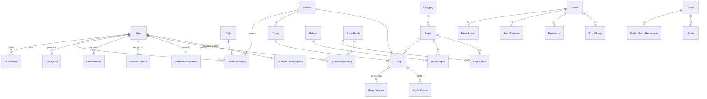

[Documentation](../README.md) › [Architecture](README.md) › **Database**

# Database

PostgreSQL 18.4, accessed through Prisma 7.9. The database is not a passive store here — it
carries a meaningful share of the system's invariants, and several of them **cannot be
expressed in Prisma's schema language at all**.

## The entity model



Plus the platform-level tables: `AuditLog`, `Trash`, `SystemSetting`, `AcademicYear`,
`EducationalContent`, `ConsumedToken`, `RateLimitCounter`, and `HijriMonthStart`.

> The authoritative field-by-field definition is SRS §7. This page explains the parts that
> are non-obvious.

## Entities that carry a design decision

### `User` — one table, several kinds of person

Staff, parents, adult students, and minors are all `User` rows. What differs is what hangs
off them.

| Column | Why it exists |
|---|---|
| `account_status` | The lifecycle: pending → active → suspended, with rejected terminal. Separate from a per-branch `user_status` |
| `sex` | The **person-side half** of the level's `gender_restriction`. Without it the restriction is unenforceable — nothing could compare a person against a girls-only level. Captured **at registration**, in the same transaction that creates the person, because the registration exists before the `User` does |
| `pre_provisioned_email` | The address authorized to claim this account **before any external identity exists**. Unique among non-null values. **Retained after binding**, never cleared, so provenance survives and the address cannot be claimed twice |
| `public_display_name` | An optional name the person chooses to publish. Distinct from `nickname`, which is an internal search convenience — this is a publication choice |
| `version` | Optimistic locking on staff edits |

### `UserIdentity` — completed bindings only

Keyed by `(provider, provider_subject_id)`, unique. MVP has one provider: Google.

**Placeholder rows are prohibited.** A row with a null, empty, or synthetic subject id
standing in for an unbound account would make *"has an identity"* stop meaning *"has
authenticated"* — and that predicate is what the entire login routing rests on. An account
awaiting its first binding is represented by `pre_provisioned_email` and nothing else.

### `UserBranchRole` — the whole authorization model

Unique on `(user_id, role_id, branch_id)`, so one person may hold the same role once per
branch. **`branch_id IS NULL` means all branches for that assignment** — not "Super Admin".
Super Admin's bypass follows from its role.

### `RefreshToken` — session state that has to exist somewhere

Rotation, revocation, the grace window, and revoke-on-suspension all need per-token server
state that no other entity holds.

| Field | Consumer |
|---|---|
| `token_hash` | **Hashed, never raw** — a stolen database dump must not yield usable 30-day credentials. Unique |
| `session_id` | The stable id of one rotation chain. Makes "revoke this session" a single indexed `UPDATE` instead of a recursive walk of predecessors |
| `rotated_from_id` | The immediate predecessor. **This one field decides all three refresh outcomes**: current → rotate, immediate predecessor within grace → accept, anything older → reuse detected |
| `revoked_at` / `revoked_reason` | The revocation check is `revoked_at IS NULL`. The reason separates a normal logout from a **detected replay**, which is a security event |

The fields **deliberately excluded** are documented in the specification with their reasons,
so a later implementer does not re-add them by reflex: `created_at` (identical to
`issued_at`), `revoked_by` (duplicates the audit actor, and two actor records will
eventually disagree), `created_by_ip` and `user_agent_hash` (personal data on a population
including minors, with no consumer and no retention rule), `last_used_at` (under mandatory
rotation a token is used exactly once).

### `HijriMonthStart` — the calendar's sole source

One row per Hijri month: year, month, the Gregorian date it officially began, and a status
of `draft | published`. **Only published months render anywhere**, so a year can be entered
progressively and reviewed first.

`source` records provenance on the row — `manual` today, an importer's identifier if one is
ever added — so the two are distinguishable without a schema change. Every write goes
through one service method, which is what makes a future importer inherit its ordering rule,
locking, draft state, and audit trail rather than reimplementing them.

> [Calendar and Hijri](calendar-and-hijri.md)

### `StudentSurahProgress` — a cache that cannot go stale

Coverage percentage plus the merged interval set, keyed by `(student_id, surah_id)`,
carrying `last_log_id` / `last_log_at` stamps of the newest governing log.

**It is never the source of truth — the logs are.** Every consumer compares the stamp
against the student+surah's latest log (a cheap indexed max) and, on mismatch, recomputes
from the logs and repairs the row in place *before* using the value. That makes a stale read
structurally impossible, including after a crash between the log commit and the cache
upsert.

**List pages run the guard as one joined query** — cache rows left-joined against each
pair's latest log id — never as per-row cache reads plus per-row max lookups, which would be
an N+1 wearing a cache costume.

### `ConsentRecord` and `AuditLog` — append-only by design

Consent is a **state-change history**, never overwritten. Effective status is always
derived from the most recent record, and absence means no consent.

`AuditLog.actor_user_id` is **nullable**, and a null means *system-initiated*, not
*attribution lost*. Two mandated actions genuinely have no human actor: replay-detected
session revocation (triggered by an unauthenticated request presenting a stolen secret) and
the consent job's forced visibility changes.

## Constraints the application layer cannot be trusted with

### Uniqueness

| Constraint | Guards |
|---|---|
| `UserIdentity (provider, provider_subject_id)` | One external identity, one account |
| `UserIdentity (provider, email)` among active | Case variants cannot become distinct identities |
| `ConsumedToken (jti)` | **The onboarding-token replay guard.** A replay hits this violation, the transaction aborts, and the request fails — enforcement is mechanical, not aspirational |
| `FamilyLink (student_id, parent_id)` **where not deleted** | A revoked link can be requested again later |
| `AcademicYear` exactly one `is_current` | Partial unique index |
| `RateLimitCounter (user_id, bucket, window_start)` | What makes the increment safe under concurrency |
| `User.pre_provisioned_email` among non-null | Two accounts must never claim one address, or a first login is ambiguous about which it binds |
| `RefreshToken.token_hash` | Makes "presented token → exactly one row" a lookup, not a scan |

### Checks

- `QuranProgressLog`: `start_ayah >= 1 AND start_ayah <= end_ayah`. The upper bound against
  the Surah's total crosses tables, so it is a **trigger** plus a service check.
- All stored scores: `>= 0 AND <= 10000`. **No float score column exists anywhere.**
- `display_order >= 0`; `Group.max_students > 0`; `Group.start_time < end_time`.
- `AcademicYear.label` matches `^\d{4}-\d{4}$`.
- `HijriMonthStart`: month 1–12; year 1300–1600 (brackets any date this platform will render
  while rejecting a mistyped Gregorian year); **two months of one year may not share a start
  date, and month *n+1* must start after month *n*** — an out-of-order pair would make date
  resolution ambiguous.
- `CHECK (email = lower(email))` on both email columns. The application lowercases on every
  write; **this is the backstop**, so a single unlowered code path — a form, an import — can
  never create a case variant that slips past the unique index.

## Arabic collation

The single `name` column on Branch, Category, Level, and Subject, plus sortable person-name
columns, are **natively collated `ar-x-icu` at the column level**.

This matters more than it sounds. Default `C`/`en_US` collation sorts Arabic by codepoint
and produces orderings that look wrong to every user. Collating the column means sorting is
correct **by default, in every query**, with no per-query `COLLATE` clause anywhere.

> **Never add a per-query `COLLATE` workaround. Fix the column.**
> [`BR-19`](../reference/business-rules.md#br-19) · [Internationalization](internationalization.md)

## Search

Substring matching, not prefix-only and not whole-word — `سعاد` matches `أم سعاد`. Minimum
query length 2, case-insensitive.

**Normalization is applied identically to the query and the stored value:** strip tashkeel
and tatweel, fold أإآ→ا, ة→ه, ى→ي; lowercase and fold Latin accents for French names; strip
spaces and `+` from phone numbers.

The implementation matters: each searchable column is paired with a **generated normalized
shadow column**, indexed, and queried with `ILIKE '%…%'` against the shadow. Normalization
is **never** applied per row at query time — that would defeat every index.

**No fuzzy matching in the MVP.** No trigram similarity, no Levenshtein, no search engine.
Paper-roster spelling variance is absorbed by the normalization rules, which collapse the
dominant variant classes; genuine misspellings are a data-entry problem, not a
search-engine problem. Revisiting this is an explicit decision, not an implementer's
initiative.

## Migrations

### Hand-written SQL

Prisma **cannot declare** custom collations, CHECK constraints, partial or functional unique
indexes, or triggers. An agent that writes them into `schema.prisma` will fail to compile
or — worse — silently drop the validation.

The mandatory workflow:

1. Model tables, columns, enums, FKs, and plain unique indexes in `schema.prisma` normally.
2. For every PostgreSQL-specific element, run **`prisma migrate dev --create-only`** and
   **hand-write the SQL** into the generated file before applying.
3. The very first hand-written migration **registers the collation explicitly**:
   ```sql
   CREATE COLLATION IF NOT EXISTS "ar-x-icu" (provider = icu, locale = 'ar', deterministic = true);
   ```
   Not relying on it being predefined is what makes the migration history self-contained and
   portable.
4. **`prisma db push` is prohibited in every environment** — it bypasses the history and
   silently drops the hand-written SQL. CI enforces this.

### Compatibility policy

- **Forward-only in production.** Down-migrations are never written or run. Rollback means
  restoring the pre-deployment backup.
- **Migrations preserve data — always.** A migration that loses rows is a defect regardless
  of what it enables. Every deployment takes a `pg_dump` **immediately before** applying
  migrations, so the rollback point matches the pre-migration state exactly.
- **Destructive operations follow expand–migrate–contract.** Dropping a column, or
  tightening a constraint on populated data, is permitted only as the final *contract* step
  of a three-phase sequence, with the drop in a **separate, later migration** after no
  released code references the old structure. A single migration that adds and drops is
  prohibited.
- **No direct renames.** Prisma renders a naive rename as DROP + ADD, which destroys data.
  A rename is expand–migrate–contract.
- **New NOT NULL columns** on populated tables ship with a default or an in-migration
  backfill.
- **Every migration is rehearsed** against ceiling-scale fixtures. Duration matters: an
  `ALTER` rewriting a million audit rows must be known about beforehand, not discovered
  during a deploy window.

CI enforces the append-only history, the `db push` ban, the presence of the hand-written
SQL, and flags every `DROP`/`RENAME` for human review with its contract-phase justification.

### Current migration history

```
20260724194811_init_schema
20260724210945_add_rate_limit_counter
20260724222514_add_pre_provisioned_email
20260725123714_add_refresh_token
20260728132320_add_user_sex_and_generic_categories
20260728222630_r31_hijri_month_start
20260728222900_r31_hijri_month_start_checks
20260728223400_r31_remove_hijri_day_offset
20260729045246_r35_branch_public_contact_fields
20260729045400_r35_branch_public_field_checks
20260729060000_r36_1_display_name_not_blank
20260729150624_r36_1_public_display_name
```

Note the pattern: schema changes and their hand-written constraints are **separate
migrations**, and revision-driven changes carry the revision number in the name.

## Soft delete and cascade

Every soft-deletable table carries `(deleted_at, deleted_by)`. Deleting writes a **Trash
snapshot** and an **audit row** in the same transaction.

Cascade rules are per entity and mostly *prohibitive*:

| Entity | Rule |
|---|---|
| Branch, Room, Category, Level, Group | **Deletion prohibited** while dependents reference them → `409` |
| User | **Soft delete only.** Anonymize sensitive fields in the live row (full snapshot in Trash), deactivate identities, **revoke every live refresh token in the same transaction**, cascade-remove family links and group assignments. Grades and progress logs are **retained** as historical record |
| Un-enrolment | Soft-deletes the enrolment row **only**. Never touches grades, submissions, or progress logs — a transferred student keeps their history |
| Content | Soft delete moves the object to a quarantine prefix pending the 90-day window |

Hard deletion happens only through the quarantine-purge job after 90 days.

## Connection budget

Pinned, not defaulted — the real concurrency risk on a 4 GB box is **pool exhaustion**, not
deadlock:

```
Prisma connection_limit = 10
pg-boss pool           ≤ 5
Postgres max_connections = 30
statement_timeout        = 10s
shared_buffers = 256MB · work_mem = 8MB
```

Interactive transactions must finish well inside the statement timeout.

---

**Next:** [API](api.md) · **Related:** [Backend](backend.md),
[Performance and scale](performance-and-scale.md), [Runbooks](../operations/runbooks.md)
