[Documentation](../README.md) › [Architecture](README.md) › **Database**

# Database

PostgreSQL 18.4 through Prisma 7.9. The database carries invariants, several of which Prisma's schema language cannot express. Field-by-field definitions are SRS §7; this page covers the non-obvious parts.

## The entity model

```mermaid
erDiagram
    User ||--o{ UserIdentity : "binds"
    User ||--o{ UserBranchRole : "holds"
    User ||--o| PlatformOwner : "owns platform"
    User ||--o| FramingPreference : "states willingness"
    User ||--o{ TeacherAvailability : "states windows"
    FramingPreference ||--o{ FramingPreferenceBranch : "physical branches"
    Branch ||--o{ FramingPreferenceBranch : "willingness"
    User ||--o{ FamilyLink : "parent of"
    User ||--o{ RefreshSession : "sessions"
    RefreshSession ||--o{ RefreshToken : "generations"
    User ||--o{ ConsentRecord : "subject of"
    Role ||--o{ UserBranchRole : ""
    Branch ||--o{ UserBranchRole : "scopes"
    Branch ||--o{ Room : ""
    Branch ||--o{ AdministrativeGroup : ""
    Branch ||--o{ RecurringCourseSchedule : ""
    Category ||--o{ Level : ""
    Level ||--o{ AdministrativeGroup : ""
    Level ||--o{ TeachingGroup : ""
    Branch ||--o{ TeachingGroup : "created in (R172 §15)"
    Level ||--o{ LevelSubject : ""
    Level ||--o{ LevelSurah : ""
    Subject ||--o{ LevelSubject : ""
    Subject ||--o{ TeachingGroup : ""
    Subject ||--o{ RecurringCourseSchedule : ""
    QuranSurah ||--o{ LevelSurah : ""
    QuranSurah ||--o{ QuranProgressLog : ""
    Room ||--o{ RecurringCourseSchedule : ""
    AdministrativeGroup ||--o{ Enrollment : "roster"
    TeachingGroup ||--o{ StudentTeachingGroup : "subject split"
    RecurringCourseSchedule ||--o{ CourseScheduleStaff : "teacher + assistants"
    RecurringCourseSchedule ||--o{ Session : "materialized"
    Session ||--o{ SessionContent : "references"
    EducationalContent ||--o{ SessionContent : ""
    Event ||--o{ EventBranch : ""
    Event ||--o{ EventCategory : ""
    Event ||--o{ EventLevel : ""
    Event ||--o{ EventAdministrativeGroup : ""
    Exam ||--o{ StudentExamSubmission : ""
    Exam ||--o{ Grade : ""
    User ||--o{ QuranProgressLog : "student"
    User ||--o| StudentSurahProgress : "coverage cache"
```



Platform-level tables: `PlatformOwner`, `AuditLog`, `Trash`, `SystemSetting`, `AcademicYear`, `AcademicPeriod`, `Attendance`, `ExamQuestion`, `ExamQuestionOption`, `StudentExamAnswer`, `StudentExamAnswerOption`, `EducationalContent`, `ConsumedToken`, `RateLimitCounter`, `HijriMonthStart`.

## Entities that carry a design decision

| Entity | Decision |
|---|---|
| `StorageRetirement` (B4/B5, [`20260911130000_durable_storage_retirement`](../../backend/prisma/migrations/20260911130000_durable_storage_retirement/migration.sql)) | Minimal outbox, no FK to purgeable content (the coordinate outlives content and Trash rows). SQL constrains operations, buckets, nonnegative attempts, pending/resolved locator states; pending requires its content-prefixed key, completion clears it. `copy_settled` is false only for an unresolved placement attempt (SQL forbids completing it); legacy/non-placement rows default true. Unique domain-separated coordinate/operation digest → idempotent replays; only a new authorized Content-locked transition renews a completed obligation. Operational state, not audit or job catalog — [storage lifecycle jobs](background-jobs.md#storage-lifecycle-jobs--bounded-sweep-versus-exact-obligation) |
| `User` | Staff, parents, adult students, minors: all rows. `account_status` pending → active → suspended, rejected terminal (separate from per-branch `user_status`). `sex`: person-side half of `gender_restriction`, captured at registration in the creating transaction. `pre_provisioned_email`: may claim the account before any identity; unique among non-null; retained after binding. `public_display_name`: a publication choice, distinct from `nickname` (internal search). `version`: optimistic locking on staff edits |
| `UserIdentity` | Unique `(provider, provider_subject_id)`; one provider (Google). Placeholder rows (null/empty/synthetic subject id) prohibited; an unbound account is `pre_provisioned_email` and nothing else |
| `NormalizedEmailLock(email_digest, created_at)` | One stable row per normalized address for ownership writers to lock (`pre_provisioned_email` and active `UserIdentity.email` cannot constrain each other). 64-char lowercase hex, domain-separated HMAC under `EMAIL_LOCK_KEY`; SQL CHECK rejects malformed values; [keying design](../development/email-lock-keying.md). No User FK on purpose (a third ownership record; lifecycle deletes would reopen the race); rows may outlive a claim; availability comes from an under-lock re-read of the ownership channels |
| `SelfManagedClaim` | The approved transition fact for `SELF_MANAGED`, not a credential archive. Permanent erasure clears `email`, `provider_subject_id`, decision text and related Trash snapshots; pending requests withdraw via `deleted_at`. Credential columns nullable together; SQL CHECK requires both on a live pending claim; the migration repairs only audit-proven permanent deletions |
| `UserBranchRole` | Unique `(user_id, role_id, branch_id)`. `branch_id IS NULL` = all branches for that assignment, not "Super Admin" (the bypass follows from the role) |
| `PlatformOwner` | Singleton key `platform`, unique restricted FK to the owner User. Triggers require that User active, undeleted, holding a live global Super Admin role; deleting the singleton is refused. Transfer locks the singleton, then current and target Users in id order. Labelled on the Users screen; not a Role row |
| `RoleRequest` (`role_request`, R168 §1; [identity and access](identity-and-access.md#one-registration-several-roles-r168-1)) | One row per person and role (`student · guardian · teaching · administration`), `pending → approved \| declined`. A request, never an authority (`UserBranchRole`, written only by the audited approval). UNIQUE `(user_id, kind)`; re-asking re-opens the row. Three CHECKs: pending ⇒ no `decided_at`/`decided_by`; decided ⇒ `decided_at`; `decline_reason` only on decline; `first_time` only on `student`. `first_time` NULL = nobody asked. `decided_by` SET NULL, person CASCADE (`account-deletion.service.ts` clears explicitly). Partial index on `status = 'pending'` for the approval queue, which also lists an ACTIVE account with a waiting request. The migration back-fills one request per pending registration (teaching where `requested_role = 'teacher'`, guardian where child applications wait, student otherwise) |
| `CirclePreference` (`circle_preference`) | Ranked حلقات: PK `(user_id, teaching_group_id)`, UNIQUE `(user_id, rank)`, `rank` 1–20. A wish, never a seat; nothing reads it to place anybody. The rankable set is read from the schedule each time (`registration-circle-slots.service.ts`) |
| `FramingPreference`, `TeacherAvailability` | `in_person \| online \| both`; physical modes need `FramingPreferenceBranch` rows or `all_branches = true`; deferred constraint triggers validate the final transaction state. `TeacherAvailability.mode` reuses the vocabulary per weekly interval, nullable (NULL = not stated; no migration guesses). Advisory warnings only; authority is `CourseScheduleStaff` / `SessionStaff` |
| `RefreshSession` | Only `(id, user_id, created_at)`: the stable row locked by refresh, logout, revoke-all and `token.purge`; removed only when purge, holding it, finds no generation left (generations cannot serve at READ COMMITTED). Advisory locks rejected: §16.2 permits repository raw SQL row locks and a UUID does not fit a 64-bit key. The `User` row is the higher lock for identity binding, login/session creation, current-role credential decisions and user-wide revocation incl. Pending → Rejected; order User first, then `RefreshSession` ids in UUID order. User mode `FOR NO KEY UPDATE` (`User.id` immutable; status/deletion/role decisions still conflict) is compatible with the implicit `KEY SHARE` token/audit inserts take during FK validation — `FOR UPDATE` deadlocked refresh/logout against suspension. Login re-reads status and assignments under it; the session issuer re-checks Active or Pending under it; refresh, logout and purge never take the explicit User lock |
| `RefreshToken` | `token_hash` hashed, never raw, unique. `session_id` = one rotation chain (revoke = one indexed `UPDATE`). `rotated_from_id` decides: current → rotate, immediate predecessor within grace → accept, older → reuse detected. Revocation check `revoked_at IS NULL`; `revoked_reason` separates logout, replay, suspension, R102 rejection, deletion, R101 cookie-Path rollout; NULL reserved for ordinary rotation. Excluded on purpose: `created_at` (= `issued_at`), `revoked_by` (duplicates the audit actor), `created_by_ip` / `user_agent_hash` (personal data incl. minors, no consumer or retention rule), `last_used_at` (used once) |
| `Subject.tracks_quran_progress` (R107–R108) | Authorization, not curriculum type. القرآن الكريم has no Subject row; only حفظ القرآن carries the marker; a current staffing assignment for it authorises memorisation entry. The partial unique index enforces at most one live marker ("exactly one" is impossible: empty DB before bootstrap; absence is fail-closed); the Production seed asserts exactly one and refuses a different marked Subject or duplicate live rows. `LevelSurah` = the Level's حفظ القرآن syllabus, followed by تفسير القرآن; `QuranProgressLog` keyed by student and Surah, no Subject FK. Tafsir is outside the coverage engine; أحكام القرآن, ترتيل وتجويد القرآن and later unmarked Subjects use `LevelSubject`; the eight-row seed is additive |
| `Subject.requires_surahs` (R165 §2) | A class or exam of the Subject names its Surahs. حفظ القرآن and تفسير القرآن carry it (set once by migration; no runtime name rule). `subject_tracker_requires_surahs_check` = `NOT tracks_quran_progress OR requires_surahs`; the service refuses un-marking with `TRACKER_REQUIRES_SURAHS`. Surahs live in `course_schedule_surah` (cascades with the schedule), `session_surah` (an occurrence's own, replacing the class's that date; RESTRICT) and `exam.surah_id`; the joins hard-delete (a plan correction; audit records who) |
| `LevelCompletionMark` (R167 §3) | BR-11 is derived on read, never stored (R166 §1, `policies/level-completion.ts`). The mark records an Admin/Super Admin attestation, allowed while BR-11 is unmet after `409 REQUIREMENTS_NOT_MET` → `acknowledge_unmet`; `requirements_met` keeps BR-11's reading then. Nothing reads it into BR-11, but it takes the Level out of what she is studying (R172 §14): `inProgressEnrolmentWhere` (same file) is read by «تقويمي», the library's private tier and `GET /students/me`; the enrolment is untouched; lifting the mark restores both. UNIQUE `(student_id, level_id)` (not per enrolment; R122). `branch_id` = her enrolment's branch when recorded (Admin scope, certificate). Certificate: `certificate_number` (UNIQUE, from `level_certificate_number_seq` at first issue, never reused), `certificate_issued_at`, `certificate_issued_by`, `level_completion_mark_certificate_check`; withdrawing clears the two issued columns and keeps the number. No soft delete, no Trash; removal refused while a certificate is showing |
| `CategorySubject` (R172 §1) | Same shape as `LevelSubject` (soft-deleted, unique per pair, RESTRICT both ways): a Subject taught to every live Level of the Category, present and future (الفقه to «المرأة»). Nothing is copied down: `policies/curriculum.ts` (`subjectsTaughtAt`, `levelsTeaching`, `assertSubjectTaughtAtLevel`) reads both through the Level's `category_id`; every surface asks it — «الكل» resolution (R169 §7), content initiation, scope options (`levels[].subject_ids`, `categories[].subject_ids`), public programme, personal calendar Subject filter, BR-11's «examined» Levels. Subject deletion tombstones its links (`cascaded_category_subject_ids`, `legacyOptional` in Trash plans). Routes `GET\|PUT\|DELETE /admin/categories/{id}/subjects[/{subjectId}]`; screen: «مواد المستوى»'s first table |
| `EducationalContent.whole_category` (R167 §5) | `level_id` stays NOT NULL; `whole_category = true` addresses every Level of that Level's Category. No `category_id` column: the Category is read through `level_id` (`tierPredicate`, `?level_id=` filter), so later Levels are included. `branch_id` NULL = every branch. Partial index `WHERE whole_category AND deleted_at IS NULL` serves «كل مستويات الفئة». R172 §1: `POST /uploads/initiate` takes `category_id` in place of `level_id`; the item is filed under the Category's first live Level with `whole_category`, decided at initiation and carried in the ticket |
| `EducationalContentLevel` (R169 §10) | `educational_content.level_id` remains the home Level (NOT NULL; what `assertSubjectTaughtAtLevel`, the shelves and `whole_category` read through); the join holds only ADDITIONAL Levels. PK `(content_id, level_id)`, `content_id` CASCADE, `level_id` RESTRICT (`deleteLevel`'s guard counts both). Trigger `educational_content_level_not_home` refuses the home Level, so the service clears rows BEFORE moving the home Level and writes AFTER. Three reads in `library.service.ts` know it: private tier (hers when ANY Level is hers), `level_id` filter, `category_id` filter; the consent gate derives from the class audience via `SessionContent`, never the item's Level. Ingest never writes `whole_category` and additional Levels together |
| `SessionRecording.recovered_from_segments` (R168 §2) | `true` when the final file never arrived and the recording was assembled from safety segments; status stays `completed`; availability derives from `educational_content_id`. Written only by `markRecoveredFromSegments`, the only path out of `failed`/`aborted` |
| `SessionRecording.educational_content_id` (R99) | Nullable, unique, FK RESTRICT — optional 1:1. NULL while capturing, finalising and importing. Unique so duplicate deliveries, pg-boss retries and killed workers converge on one `EducationalContent` (the ingestion job reads it first). RESTRICT so deleting the library item never erases the record of a class recorded. No `available` status: «متاح» is `educational_content_id IS NOT NULL` (R99.14). `ingestion_failure_reason` is separate from `failure_reason` (only the second is fixed by retrying) |
| `User.notes` — dropped (R121, Owner 2026-09-02) | A personal-data field needs a specific documented purpose. `20260902220000_drop_user_notes` drops it behind a guard refusing a non-blank value. Bounded fields with a purpose stay: `ChildApplication.internal_note` (R62.8), `FamilyLink.decision_reason`, `Session.cancellation_reason`; `notes` on the §5.2 Session projection is unrelated |
| `StudentSocialProfile` — dropped (R120, Owner 2026-09-02) | No health, medical or social-case-file data; no surface ever collected it. `20260902200000_drop_student_social_profile` refuses a non-empty table and reports the count (0 on Localhost and Staging; Production not deployed). Data-minimisation policy: no personal-data categories beyond current operational purposes — a technical fact, not a CNDP legal conclusion |
| `ConsentRecord` | Append-only state-change history; effective status = most recent record; absence = no consent. `consent_text_id` nullable only for pre-R119 rows (no wording manufactured); `consent_text_version` retained for exports, audit and compliance |
| `LegalConsentText` (R119) | Exact Arabic text, unique `version_label`, SHA-256 digest, `draft \| active \| superseded`, creation/activation provenance. Immutable once activated (service-enforced). Exactly one active: `legal_consent_text_one_active` partial unique index. Never deleted; `consent_record` and `child_application` reference it RESTRICT |
| `AuditLog.actor_user_id` | NULL = system-initiated (replay-detected session revocation; the consent job's forced visibility changes), never "attribution lost" |

### `HijriMonthStart` — the calendar's sole source

- One row per Hijri month: year, month, Gregorian start date, status `draft | published`; only published months render anywhere.
- `source` records provenance (`manual` today; an importer's identifier if added). Every write goes through one service method (ordering rule, locking, draft state, audit) — [Calendar and Hijri](calendar-and-hijri.md).

### `StudentSurahProgress` — a cache that cannot go stale

- Coverage percentage plus merged interval set, keyed `(student_id, surah_id)`, with `last_log_id` / `last_log_at` of the newest governing log.
- Never the source of truth: every consumer compares the stamp with the student+surah's latest log (indexed max) and on mismatch recomputes from the logs and repairs the row before use — stale reads are impossible, including after a crash between log commit and cache upsert.
- List pages run the guard as one joined query (cache rows left-joined to each pair's latest log id), never per-row reads plus per-row max lookups.

### Every application session is UTC (since 2026-09-21)

- `@prisma/adapter-pg` exchanges `timestamptz` as offset-less text, correct only in a UTC session; the database default is `Africa/Casablanca` (the `db` container's `TZ` in `postgresql.conf`), so instants were written an hour early and read an hour late — cancelling on round trips, not for `DEFAULT now()`, raw SQL against `now()`, backups, exports or `psql`.
- `createPrismaClient` opens every session with `options: '-c TimeZone=UTC'` — on the connection, not the database, because it is the adapter's assumption and travels with it; an operator's session still reads the association's clock. No SQL depends on the session zone (`date`/`time` columns, TD-11).
- `lib/prisma-timezone.integration.test.ts` checks what Postgres understood and what the app makes of `now()`, and requires the database NOT be UTC so it cannot go vacuous.
- Data written before the fix is one hour early in absolute terms; no Production data; Localhost and Staging carry it knowingly.

## Constraints the application layer cannot be trusted with

### Uniqueness

| Constraint | Guards |
|---|---|
| `UserIdentity (provider, provider_subject_id)` | One external identity, one account |
| `UserIdentity (provider, email)` among active | Case variants cannot become distinct identities |
| `ConsumedToken (jti)` | The onboarding-token replay guard: a replay violates it and the transaction aborts |
| `FamilyLink (student_id, parent_id)` where not deleted | A revoked link can be requested again |
| `AcademicYear` exactly one `is_current` | Partial unique index |
| `ExamQuestion (exam_id, display_order)` where not deleted | Two questions cannot claim one place (R124); partial so a removed question frees its position; the reorder writes through a negative range first (`1,2,3` over `3,1,2` collides halfway) |
| `ExamQuestionOption (question_id, display_order)` where not deleted | Same for a question's choices: their order is part of what the student saw |
| `StudentExamAnswer (submission_id, question_id)` | One answer per question — the key the replaced `answers` jsonb asked for, as a foreign key |
| `Attendance (session_id, event_id, exam_id, occurrence_date, student_id)` where not deleted, `NULLS NOT DISTINCT` | One presence per person per occurrence (R123); without `NULLS NOT DISTINCT` the two null occurrence columns would permit unlimited duplicates (the double-tap on «تسجيل حضوري») |
| `AcademicPeriod (academic_year_id, sequence)` | One الفصل 1، one الفصل 2 per year |
| `RateLimitCounter (user_id, bucket, window_start)` | Makes the increment safe under concurrency |
| `User.pre_provisioned_email` among non-null | Two accounts never claim one address |
| `NormalizedEmailLock.email` | One collision-free transaction boundary across pre-provisioned and completed ownership, incl. absent-row creation |
| `RefreshToken.token_hash` | Presented token → exactly one row, by lookup |
| `RefreshToken.session_id → RefreshSession.id` | Every generation has one stable serialization target |
| `Enrollment (student_id, level_id, academic_period_id)` where not deleted | Exactly one live enrolment per Level per academic period (BR-21, narrowed by R122); the period is in the key so re-enrolling next semester keeps the previous row as history. Expressible only because `level_id` sits on the enrolment row |
| `AdministrativeGroup (id, level_id)` | Redundant against the PK on purpose: PostgreSQL requires it before `Enrollment` can declare its composite FK |
| `StudentTeachingGroup` at most one per `(student, subject, level)` where not deleted | At most one split-group per subject (BR-22); `subject` and `level` come from the teaching group, so it is a hand-written functional index over the join |
| `Session (schedule_id, date)` | Makes `session.materialize` idempotent |

- Composite FK `Enrollment (administrative_group_id, level_id) → AdministrativeGroup(id, level_id)`: the database refuses a row whose level disagrees with its group's. The redundant `level_id` is a constraint, not a copy; a trigger or service check could be bypassed. Never drop this FK to "simplify" the schema.

### Checks

- `user_beneficiary_birth_date_check` (R169 §9): `NOT is_beneficiary OR deleted_at IS NOT NULL OR birth_date IS NOT NULL`; the column stays nullable (guardian-only adults and staff requests are never asked, R49/R130); deleted rows are exempt (de-identification erases the date). Trigger `user_beneficiary_birth_date_fill` gives a live beneficiary row without a date the fixed `1900-01-01` with `birth_date_is_placeholder = true` (any path, restore or script included) and clears the mark when another date is written; `user_birth_date_placeholder_check` ties the mark to that date. The placeholder is a mark, never an age: `knownBirthDate()` (`lib/birth-date.ts`) answers `null` for it (naively it would make a child «eligible at eighteen», R132); DTOs send `birth_date: null`. Recording it is completion (R130): once; correcting a recorded date stays refused.
- `QuranProgressLog`: `start_ayah >= 1 AND start_ayah <= end_ayah`; the upper bound against the Surah total crosses tables, so it is a trigger plus a service check.
- All stored scores `>= 0 AND <= 10000`; no float score column exists.
- `display_order >= 0`; `RecurringCourseSchedule.start_time < end_time`; `Session.start_time < end_time`; `Room.capacity > 0` when present (shape only; nothing compares a roster against it, BR-23).
- `RecurringCourseSchedule`: exactly one target FK non-null and matching `teaching_mode` (`course_schedule_mode_target_check`); `recurrence <> 'none'` (a one-off is an Event).
- `AcademicYear.label` matches `^\d{4}-\d{4}$`.
- `Exam`: exactly one target matching the declared arm (`exam_target_check`, R124) — with a Session, a Teaching Group and a single beneficiary as targets, R58's "NULL group = whole Level" inference stopped being decidable, so the arm is stored.
- `ExamQuestion`: `justification = 'none'` unless the kind is a choice (`exam_question_justification_check`; a text answer is its own justification); prompts and option labels refused blank.
- `Attendance`: exactly one of `session_id`, `event_id`, `exam_id` non-null (`attendance_one_occurrence_check`; the idiom `Notification` uses for its four targets).
- `AcademicPeriod`: `sequence >= 1`, `end_date >= start_date`. Overlap between two periods of one year is refused in the service only — an exclusion constraint needs `btree_gist`, and the deployment contract installs no extensions.
- `HijriMonthStart`: month 1–12; year 1300–1600; two months of one year may not share a start date; month *n+1* starts after month *n*.
- `CHECK (email = lower(email))` on both email columns — the backstop for any unlowered code path.

## Arabic collation

- The `name` column on Branch, Category, Level and Subject, plus sortable person-name columns, are collated `ar-x-icu` at the column level, so ordering is correct in every query with no per-query `COLLATE`.
- Never add a per-query `COLLATE` workaround; fix the column. [`BR-19`](../reference/business-rules.md#br-19) · [Internationalization](internationalization.md)

## Search

- Substring matching (`سعاد` matches `أم سعاد`), minimum query length 2, case-insensitive.
- Normalization applied identically to query and stored value: strip tashkeel and tatweel; fold أإآ→ا, ة→ه, ى→ي; lowercase and fold Latin accents; strip spaces and `+` from phone numbers.
- Each searchable column has a generated, indexed normalized shadow column queried with `ILIKE '%…%'`; normalization is never applied per row at query time.
- No fuzzy matching in the MVP (no trigram, Levenshtein or search engine); revisiting it is an explicit decision.

## A model with no `@@map` silently targets a different table

- Tables are `snake_case`, models `PascalCase`; dropping `@@map("exam")` still validates and generates a client querying `"Exam"` — surfacing as `The table public.Exam does not exist`, which reads as an unapplied migration (R58's hand-rewritten model block lost `@@map` and `@@index`).
- Rewriting a model block means re-checking its trailing `@@` lines; run something that touches the table before believing the model ([measure, don't infer](../development/engineering-efficiency.md)).

## Migrations

### Hand-written SQL

Prisma cannot declare custom collations, CHECK constraints, partial or functional unique indexes, or triggers.

1. Model tables, columns, enums, FKs and plain unique indexes in `schema.prisma`.
2. For every PostgreSQL-specific element, run `prisma migrate dev --create-only` and hand-write the SQL into the generated file before applying.
3. The first hand-written migration registers the collation: `CREATE COLLATION IF NOT EXISTS "ar-x-icu" (provider = icu, locale = 'ar', deterministic = true);` — the history is self-contained.
4. `prisma db push` is prohibited in every environment; CI enforces this.

### The R124 legacy mapping

`20260904090000_r124_assessment_builder` drops two `jsonb` columns and writes a value no old column proves (audited 2026-09-04). Preflight: [three counts against production first](../operations/deployment.md#the-r124-migration-has-a-mandatory-preflight-and-it-is-three-counts).

- `target_kind` is derived from a real fact: R58 read `administrative_group_id` NULL as the whole Level, so `NULL → level`, `NOT NULL → administrative_group`; nothing fabricated.
- `status = 'published'` is a choice and inert: `is_published` was never written or read by application code; every reader of `exam.status` is scoped `mode = 'online'` in `assessment.service.ts`; `published` is the conservative direction if that changes, and `createPhysicalExam` writes the same value.
- Neither blob is discarded: a non-empty `exam.questions` or `student_exam_submission.answers` is snapshotted into `Trash` (ordinary 90-day `purge_after` — a safety net, so the preflight refuses to migrate when either is non-empty). Here both were empty except one fixture with an auto-scoring shape (`correctIndex`, `maxPointsBp`) v1 does not have.
- The `NOT NULL` window (`ADD COLUMN` → `UPDATE` → `SET NOT NULL`) is inside one transaction; the application is stopped during runbook step 5.

### Compatibility policy

- Forward-only in production; no down-migrations; rollback = restore the pre-deployment backup.
- Migrations preserve data; every deployment takes a `pg_dump` immediately before applying them.
- Destructive operations follow expand–migrate–contract; the drop is a separate, later migration after no released code references the old structure; add-and-drop in one migration is prohibited.
- No direct renames (Prisma renders them DROP + ADD).
- New NOT NULL columns on populated tables ship with a default or an in-migration backfill.
- Every migration is rehearsed against ceiling-scale fixtures (duration known beforehand).
- CI enforces the append-only history, the `db push` ban, the presence of hand-written SQL, and flags every `DROP`/`RENAME` for review with its contract-phase justification.

### Current migration history

```
20260724194811_init_schema
20260724210945_add_rate_limit_counter
20260724222514_add_pre_provisioned_email
20260725123714_add_refresh_token
20260728132320_add_user_sex_and_generic_categories
20260728222630_r31_hijri_month_start
20260728222900_r31_hijri_month_start_checks
20260728223400_r31_remove_hijri_day_offset
20260729045246_r35_branch_public_contact_fields
20260729045400_r35_branch_public_field_checks
20260729060000_r36_1_display_name_not_blank
20260729150624_r36_1_public_display_name
20260801194116_r39_user_intended_branch
20260802131723_r40_arabic_name_parts
20260802135318_r41_french_name_parts
20260804101500_r43_educational_model_expand
20260804101600_r43_educational_model_constraints
20260804180000_r43_4_session_staff_snapshot
20260804200000_r43_contract_drop_retired_model
20260805190000_r49_requested_role
20260805200000_r49_intended_category
20260805210000_r50_effective_until
20260809120000_r57_schedule_title
20260809180000_r58_exam_mode
20260809190000_r58_exam_branch_date_index
20260811120000_r62_child_applications
20260811180000_r64_child_application_branch
20260811210000_r66_enrollment_branch
20260812090000_r68_identity_review
20260812150000_r71_event_staff
20260812170000_r73_quran_subject_marker
20260818120000_r77_session_cancellation_notification
20260818160000_r78_assignment_and_reschedule_events
20260818200000_r79_beneficiary_fact
20260818220000_r80_sex_not_null
20260819000000_r81_exam_max_grade
20260819120000_r82_notification_targets
20260819160000_r83_optional_reason
20260819200000_r88_teaching_profile
20260819230000_r91_effective_staffing
20260820010000_r92_session_audience_branch
20260820120000_r93_event_staff_assigned
20260820160000_r96_user_qr_identity
20260820180000_r97_delivery_mode
20260821090000_r99_recording
20260821140000_r99_recording_ingestion
20260821200000_r101_refresh_cookie_path_reason
20260821200100_r101_invalidate_legacy_refresh_sessions
20260823100000_r101_refresh_session_anchor
20260823190000_r102_rejection_revocation_reason
20260823210000_normalized_email_ownership_lock
20260826120000_r109_scheduling_visibility
20260826140000_r110_scheduling_type_catalogue
20260827120000_new_i_branch_phone_secondary
20260827160000_new_kl_category_level_description
20260828140000_new_n_partner
20260828170000_one_role_per_account
20260828190000_holiday_structural_kind
20260828190100_holiday_catalogue
20260828200000_partner_description
20260830100000_name_part_sort_columns
20260831100000_platform_owner_and_framing_preferences
20260901100000_r116_actionable_notifications
20260901103000_r116_exam_changed_notification
20260901110000_r117_registration_review_details
20260901220000_partner_deletion_provenance
20260902160000_scheduling_type_on_schedule_and_exam
20260902180000_versioned_legal_consent_text
20260902200000_drop_student_social_profile
20260902220000_drop_user_notes
20260903090000_r122_academic_period_enrollment
20260903180000_r123_attendance
20260904090000_r124_assessment_builder
20260904100000_drop_exam_access_policy
20260904110000_soft_delete_rejected_family_links
20260904120000_r130_birth_date
20260904130000_r132_self_managed_claim
20260904140000_self_managed_authority_index
20260904150000_r131_full_deletion_request
20260904160000_full_deletion_executed_at
20260904170000_account_return_request
20260904190000_assessment_published_notification
20260905100000_drop_account_return_request
20260905110000_drop_full_deletion_request
20260905120000_account_status_decided_at
20260908090000_r134_exam_source_id
20260908100000_r136_exam_available_from
20260909090000_r137_exam_question_points
20260909090100_r137_academic_year_soft_delete
20260909090200_r137_class_recurrence_none
20260909100000_r137_academic_year_label_live_unique
20260909120000_r138_session_title
20260909132600_r138_legal_documents
20260911100000_deletion_generation_identity_minimization
20260911110000_selfmanaged_rejection_audit_minimization
20260911130000_durable_storage_retirement
20260915180000_r151_grade_question_score
20260916100000_r155_multi_dimension_schedule_expand
20260916110000_r155_multi_dimension_schedule_constraints
20260916120000_r156_created_by_audit_trail
20260917090000_r161_session_audience_dimensions_and_subject
20260920100000_r165_surahs_in_scheduling
20260921090000_r166_class_title_is_composed
20260922090000_r167_whole_category_content_and_level_completion_mark
20260923090000_r168_recording_recovered_from_segments
20260923100000_r168_role_requests
20260924090000_r169_beneficiary_birth_date_required
20260924100000_r169_content_additional_levels
```

- Schema changes and their hand-written constraints are separate migrations; revision-driven changes carry the revision number.
- R101 is two adjacent migrations (PostgreSQL cannot add an enum value and consume it in one transaction): the first adds `cookie_path_migration`; the second, one data-modifying CTE, writes system audit and revokes every still-live pre-cutover token. Deployment stops the old issuer before either; `_prisma_migrations` is the one-time cutover marker, so a repeated `migrate deploy` cannot revoke new sessions; running the SQL manually after cutover is prohibited. The later R101 anchor migration creates one `RefreshSession` per distinct `session_id`, refuses a chain spanning more than one user, then adds the FK; it does not repeat the invalidation.
- R102 only adds the `rejection` attribution value; the application transaction performs each revocation.
- The plaintext normalized-email migration creates and backfills lock targets only, never an owner; it aborts if one email names more than one User across retained pre-provisioned addresses and active identities — reconcile per the deployment runbook and rerun (idempotent).
- The B3 transition replaces those coordinates with the [HMAC key space](../development/email-lock-keying.md) by stopped-writer truncate/re-key (not a digest backfill), makes claim identity fields nullable as a pair and minimizes audit-proven permanently erased claims; User Trash and recoverable claims are preserved. [`verify-deletion-upgrade.mjs`](../../scripts/test/verify-deletion-upgrade.mjs) checks row preservation, SQL constraints and repository reads/locks. Whole-schema comparison reports the same 26 unrelated SQL/Prisma differences before and after (named indexes, defaults, raw-SQL FKs/types): separate review, not a corrective migration or `db push`.
- R141's data-only migration removes only the top-level `reason`, `decisionReason`/`decision_reason` and `rejectionReason`/`rejection_reason` fields on `selfmanaged.reject` audit events; no PII guessing, row deletion or schema change; atomic, idempotent; stop old writers first and restart only the corrected release. Live-host execution is separately authorized.

### Filename order is apply order

- The `r36_1` constraint (`…060000`) predates the column it constrains (`…150624`): on a clean database the CHECK failed (`column "public_display_name" does not exist`, SQLSTATE 42703) while every existing database was fine (found by the shadow-database replay, R39).
- Repair: both migrations `IF NOT EXISTS` and order-independent — renumbering would orphan the `_prisma_migrations` row; the two recorded checksums were recomputed in place (`sha256` of the file) because nothing was in production.
- Rule: a migration must run on an empty database, in filename order, with no predecessor it does not name; a constraint split from its column takes the later timestamp. `check-migrations.sh` verifies presence; ordering is proven by `migrate deploy` against a fresh database in the release check.

## Soft delete and cascade

Every soft-deletable table carries `(deleted_at, deleted_by)`; deleting writes a Trash snapshot and an audit row in the same transaction.

| Entity | Rule |
|---|---|
| Branch, Room, Category, Level, Group | Deletion prohibited while dependents reference them → `409` |
| User | Soft delete only: anonymize sensitive fields in the live row (full snapshot in Trash), deactivate identities, revoke every live refresh token in the same transaction, cascade-remove family links and group assignments; grades and progress logs retained |
| Un-enrolment | Soft-deletes the enrolment row only; grades, submissions and progress logs untouched |
| Content | Soft delete moves the object to a quarantine prefix for the 90-day window; purge removes the quarantined object too |
| Hijri month | Only the last recorded month may be withdrawn (R59.5): the months are the contiguous sequence §5.7's conversion walks |
| Exam | Soft delete cascades to `ExamStaff` only, the first cascading type restore reinstates (R59.3). R172 §6: an exam holding a paper or mark is refused (`STUDENT_EVIDENCE_EXISTS`, with counts) until `?acknowledge_evidence=true`; papers, answers, marks and attendance then stay on the tombstone — hidden, restored with it, destroyed on purge (`purgeExamEvidence`, counts in the audit), like a class's occurrences (R170 §8). Supersedes the 2026-09-03 refusal-only rule |

### What gets a Trash entry (R59.2)

- A deletion a person deliberately performed gets its own Trash entry; rows removed as a consequence do not (the parent's snapshot describes them).
- Entries: un-enrolling a student, removing a Teaching Group member, unassigning a Subject from a Level, unlinking content from a Session, unassigning a Surah (`LevelSurah`). No entry: `SessionStaff` reconciliation during a session edit, `UserBranchRole` revocation during a role change (fields of an update).
- Re-assigning either unique curriculum pair revives the existing row and removes that exact stale Trash entry in the same transaction.
- `services/trash-coverage.integration.test.ts` parses each exported delete/remove/unassign operation and checks its own body (a file-wide check missed `unassignSurahFromLevel` and `deletePartner`).

### Restoring children: one timestamp per deletion

- A restore identifies the rows a deletion removed by comparing their tombstone with the record's own `deleted_at`, so the deleting service stamps record, children and snapshot from one `new Date()` (`deleteExam` once used three readings and a restored exam came back with no staff).
- The restore keys on the record's tombstone, never the Trash entry's (written later).
- A parent snapshot names exact consequence ids: Subject and Level deletion record the `LevelSubject`, `LevelSurah` and empty `AdministrativeGroup` ids; restore and purge use only those; a legacy snapshot without them fails closed on restore and deletes no guessed child on purge (PostgreSQL refuses the parent if a child remains).

### What comes back with a Level, a circle and a class schedule (R169 §8)

Each reinstatement is tested against PostgreSQL (`trash-lifecycle.integration.test.ts`).

| Type | Comes back | Does not, and why |
|---|---|---|
| `TeachingGroup` | The seats its deletion released (`restoreCircleSeats`) | A seat whose student is since seated in another circle of the same Subject and Level (one live seat per `(student, subject, level)` index) or no longer enrolled at the Level; counted in `seats_not_restored` |
| `RecurringCourseSchedule` | The occurrences still AHEAD, by snapshot ids (`removed_session_ids`) — never ones `session.materialize` would invent or protection spared | Past-dated occurrences; refused whole with `SCHEDULE_CONFLICT` when the room or staff was booked since (`findConflicts` over the returning span) |
| `Level` | Its `LevelSubject`, `LevelSurah` and `AdministrativeGroup` rows by snapshot id, and the activities addressed to it or its groups | An activity since deleted; a pre-R169 Level snapshot recorded no activity links (hard-deleted, no tombstone) — restores without them and says so (`event_links_unknown`) |

- Each refuses while a parent is still in the Trash (`PARENT_DELETED`, over several FKs — `parents`). A returning seat re-enqueues consent re-evaluation.
- `AdministrativeGroup` on its own, `Session`, `Event`, `Enrollment`, `StudentTeachingGroup`, `FamilyLink` and `EducationalContent` stay read-only in the Trash: reinstatement is not written.

### Hard deletion

- `DELETE /admin/trash/{id}` (R59.1): a Super Admin destroying a record. Removed children are declared per type in `PURGEABLE`, never inferred; any other reference is refused by the `Restrict` FK — the database is the authority on what still points at a row.
- The quarantine-purge job after 90 days: the queue handles exact replacement, deletion and manual-purge storage obligations, but the automatic age arm is intentionally absent (R59.4); `purge_after` is written on every tombstone and nothing reads it, pending the Owner decision.
- A `RESTRICT` violation is not `P2003` (`23503`): `onDelete: Restrict` raises `23001 restrict_violation`, surfaced by the Prisma 7 adapter as `P2039` with the SQLSTATE in `meta.driverAdapterError.cause.code`. Match the SQLSTATE, not the Prisma code.

## Connection budget

Pinned, not defaulted — the risk on a 4 GB box is pool exhaustion:

```
Prisma connection_limit = 10
pg-boss pool           ≤ 5
Postgres max_connections = 30
statement_timeout        = 10s
shared_buffers = 256MB · work_mem = 8MB
```

Interactive transactions must finish well inside the statement timeout.

---

**Next:** [API](api.md) · **Related:** [Backend](backend.md),
[Performance and scale](performance-and-scale.md), [Runbooks](../operations/runbooks.md)
