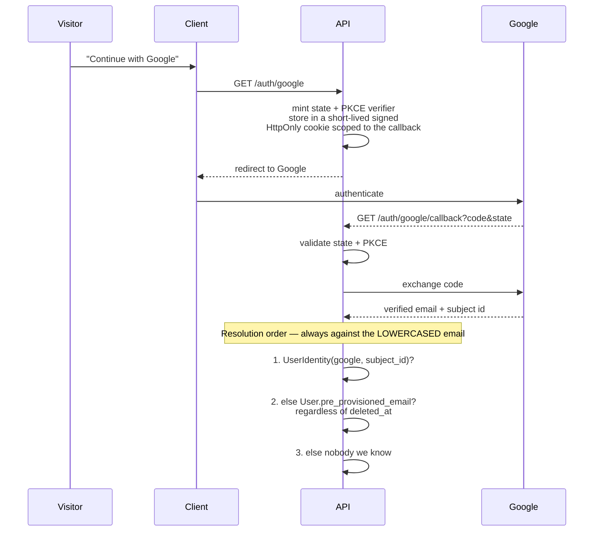
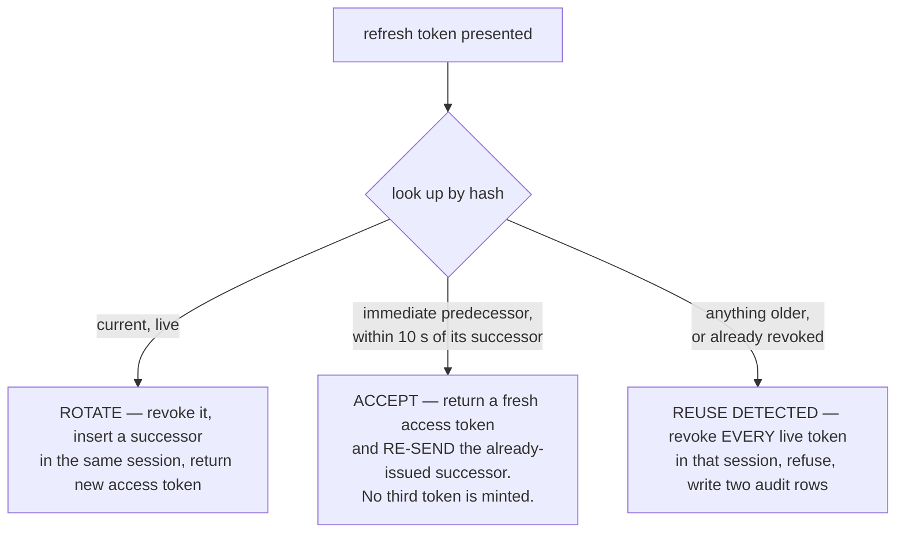

[Documentation](../README.md) › [Architecture](README.md) › **Identity and access**

# Identity and access

The part of the system with the most consequence if it is wrong. Read it before touching
anything that decides who may see what.

Four separable concerns, in the order a request meets them:

1. **[Authentication](#authentication)** — who is calling
2. **[Sessions](#sessions)** — how that survives across requests
3. **[Authorization](#authorization)** — what they may do
4. **[Child context](#child-context)** — whose data they may act on

---

## Authentication

**Google OAuth is the only identity provider.** No passwords, no hashes, no reset flows, no
password columns "for later". Minor students have no login identity at all.

The identity layer is **provider-abstracted** — a `UserIdentity` table keyed by provider and
subject id — specifically so local credentials can be added post-MVP without restructuring
`User`. That abstraction exists because the Google-only decision has a known cost
([Risk R-1](../overview/scope-and-roadmap.md#open-risks)).

### The onboarding sequence

**OAuth-first: the registration form is never shown before Google authentication
completes.** The verified email therefore always exists before any account data is
collected, and the email field on the form is pre-filled and read-only.



Then routing:

| Case | Action |
|---|---|
| **Identity exists** | Establish the session and route on the **complete** condition (below) |
| **Pre-provisioned match** | **Create and bind** the identity transactionally, then route by status. From here every later login resolves at step 1 |
| **Nobody we know** | Issue a short-lived onboarding token, redirect to the registration form |

### The routing condition, in full

```
account_status = Active     AND deleted_at IS NULL  → role dashboard
account_status = Pending    AND deleted_at IS NULL  → approval-status screen, zero data access
account_status ∈ {Rejected, Suspended} OR deleted_at IS NOT NULL
                                                    → "Account deactivated"
```

**Both terms are required.** Routing on `account_status` alone would hand a soft-deleted
user a dashboard, because a soft delete sets `deleted_at` without necessarily moving the
status.

This condition took two revisions to get right, and the bug it fixed is instructive. The
pre-provisioned lookup was originally scoped to `deleted_at IS NULL` — which is exactly what
made a deleted account **unreachable**, so it fell through to onboarding and the platform
would have offered **a deleted person the registration form**, contrary to the rule that
nothing silently re-registers. The scoping was removed and refusal became solely the
routing condition's job: **one rule instead of two half-rules** (Revision 20).

### The onboarding token

Short-lived (10 minutes), signed, single-use. It carries the verified email and subject id
from the callback to the form submission.

**The server extracts identity exclusively from the token payload.** Any email or OAuth
identifier in the request body is ignored entirely — the schema for that endpoint does not
even accept those fields, so a client cannot bind a different identity than the one Google
verified.

**Single-use is enforced mechanically.** Every token carries a unique `jti`; at submission
the `jti` is inserted into `ConsumedToken` **inside the registration transaction**, under a
unique constraint. A replayed token hits the violation, the transaction aborts, and the
request fails with `409`. Not a check — a constraint.

### Callback failures are redirects, never JSON

The callback is a browser redirect flow. Its failures never emit the API error envelope;
they redirect to `/login?error=<key>` and render as a friendly message with a retry:

`user_denied` · `state_mismatch` (also logged as a security event) · `oauth_unavailable` ·
`email_unverified` (hard stop, no account touched).

No partial state is ever persisted on any failure path.

### Email normalization

Every Google email is **lowercased before every lookup and every write** — identity
binding, pre-provision matching, the bootstrap comparison, persistence. The database
independently enforces lowercase storage with a `CHECK`, so a single unlowered code path
cannot create a case variant that slips past the unique index.

---

## Sessions

| Token | Lifetime | Transport |
|---|---|---|
| **Access** | 1 hour | `Authorization: Bearer` header — **never a cookie** |
| **Refresh** | 30 days | `HttpOnly; Secure; SameSite=Lax` cookie |

### The CSRF posture

Because the access token lives in a header and never in a cookie, **ordinary API mutations
are structurally immune to CSRF** — a cross-site attacker cannot set the header.

`POST /auth/refresh` is **the only cookie-authenticated route** in the system. It
additionally requires a custom header (`X-Requested-With`) and validates the `Origin`
against the configured public base URL. Combined with `SameSite=Lax`, that closes the
remaining surface without a double-submit token system.

> **Same-origin routing is a delivery mechanism, not a security shield.** Never treat it as
> CSRF protection by itself.

### Rotation, and the three outcomes

Refresh tokens are stored **hashed, never raw** — a stolen database dump must not yield
usable 30-day credentials. The presented value is hashed and looked up against the unique
hash. Exactly three outcomes, decided by the predecessor pointer and the revocation flag:



Three details carry real weight:

**The grace window is idempotent.** It returns the *already-issued* successor rather than
minting a third token. Rotating there would **fork the chain into two live tokens, and a
forked chain makes reuse detection impossible.** The window exists to absorb the race
created by multiple browser tabs, which the client also mitigates with a single-flight
mutex — one in-flight refresh, concurrent callers awaiting its result.

**Reuse ends the whole session.** A replayed rotated token is the signature of a stolen
cookie, so the response is to end the session, not to extend grace. Never accepted, never
resurrected.

**Every refusal looks identical.** Expired, revoked, unknown, purged, reuse-detected — all
answer `401` in the standard envelope. **No new error code was introduced**, deliberately:
telling the holder of a stolen cookie *why* it failed would confirm the token was once real.
The distinction is recorded in the audit log, not in the response.

Revoke-all exists as an internal capability — suspension and deletion use it — but **there
is no user-facing "log out everywhere" control**, no such route, and no such navigation
node. The capability exists because safeguarding requires it, not because a user invokes it.

### Freshness: where statelessness ends

An unexpired access token is **not sufficient authorization** for a defined set of
operations. Each of these asserts against the database, **per request**, that the caller is
still `Active` and still holds the invoked role and scope:

- Presigned URL minting
- Any read of a student's social profile
- Approval actions
- Consent-gate overrides and staff-recorded consent
- Pass/fail overrides
- User-management mutations

The reasoning is explicit: a teacher or admin suspended mid-session must lose access to
minors' case files and private recordings **immediately**, not at token expiry. A one-hour
stateless window is acceptable for reading your own schedule; it is not acceptable for
safeguarding-sensitive reads.

The assertion is one indexed read on low-frequency endpoints, so latency targets are
unaffected. Parent→child access is already fresh by construction — the link is checked on
every request anyway.

### JWT claims

```
sub            user id
roles[]        derived from role_scopes at issue time, so the two cannot disagree
role_scopes[]  one entry per role held: { role, branches }
               branches: null  ⇒  ALL branches for that assignment
account_status
iat / exp
```

**A flat `branch_scopes[]` is deliberately not a claim.** It cannot express "all branches",
and unioning scopes across roles extends one role's authority to another role's branches.

**No PII beyond these. No email in the token. The active child is never a claim.**

---

## Authorization

**Branch is the sole access-control axis.** Everything else is a capability.

A role assignment is `(user, role, branch)`, unique. The branch may be `NULL`, meaning **all
branches for that assignment** — not a Super Admin marker; Super Admin's bypass is a
property of its role.

### Scope resolves per role

```
capability granted by role R
   is constrained by the branches attached to R's OWN assignments
   — never by branches reaching the user through a different role
```

The failure this prevents is concrete: a Teacher in Casablanca who is also an Admin in
Marrakesh must not thereby administer Casablanca. The implementation resolved scope as a
flat union until Revision 24 caught it.

Related and equally concrete: `branch_id IS NULL` was documented as "unscoped (Super
Admin)" while the implementation derived an *empty* scope list from it — so an Admin
assigned to all branches could see **0 of 2**.

### Teachers reach students through groups only

A Teacher's role assignment carries the role, **not** their teaching reach. Exam authoring,
Quran logging, content upload, and case-file access all resolve **exclusively** through
group assignment. A teacher teaching Level 1 in Marrakesh and Level 2 in Casablanca is
expressed by two group assignments, because a group carries both level and branch.

### The permission matrix

Normative in TD-2, and it is **enforced server-side on every endpoint**. UI hiding is never
the enforcement mechanism.

A few rows worth knowing without opening the table:

- **Reference data** (branches, rooms, levels, categories, subjects, academic year,
  settings, display order, the Hijri calendar) — **Super Admin writes**. Admin reads within
  scope. **Teacher: no access at all** — they receive reference information through the
  operational APIs they are authorised to use (Revision 30).
- **Branch event backfill** stays an **Admin** capability, because it is operational work
  (populating events when a branch activates), not reference management.
- **Student social profile** — read *and* write for Super Admin, Admin in scope, and a
  Teacher for their own assigned students. **Never parents, never students.** Both reads
  and writes are audited.

> [Technical design § TD-2](../reference/technical-design.md#td-2) ·
> [Users and roles](../overview/users-and-roles.md)

### Routes are not the boundary

Permission checks live in services. The `/admin/*` prefix is **not** a permission boundary —
moving endpoints to `/superadmin/*` purely because of who may call them was rejected as
pointless churn.

---

## Child context

The safeguarding gate. A parent acting for a minor asserts which child on **every** request.

```
X-Active-Child-ID: <child user id>
```

### Resolution, in order

| Situation | Behaviour |
|---|---|
| **Header present** | Verify an `Approved` family link matching **BOTH** the authenticated parent **AND** the header's child. Matching the child alone is a vulnerability |
| **Header absent + caller holds the Student role** | **Bypass entirely.** The acting student is the caller; ownership is verified against the token subject. Adult students never need and never send the header |
| **Header absent + caller is Parent-only** | `400` — the request is genuinely ambiguous without a child |

Every other failure — no such child, another parent's child, pending, rejected, deleted —
returns **`404`**, indistinguishable from each other and from a child that does not exist.

### Why per request

Because it makes revocation instant. Soft-deleting an approved link **is** the revocation
mechanism: the middleware re-checks the row on the very next call, and a deleted link is
already among the `404` conditions. No `Approved → Revoked` transition exists or should be
added — the enforcement is already complete.

The resolved acting-student id is what downstream policies and repositories receive. **They
never trust a student id from a request body or query string** for authorization.

Client-side context switching is presentation only. The header is an assertion; the server
decides.

> SRS §4.3 · [`BR-5`](../reference/business-rules.md#br-5) · §20 rule 6

---

## Bootstrapping the first administrator

A chicken-and-egg problem with a carefully specified answer.

`SUPER_ADMIN_EMAIL` is a **bootstrap configuration value, not an operational one.** The
seed consults it **only when no active Super Administrator exists**. Once one does, the
value is **ignored permanently** and may be removed from the environment entirely;
administrators are managed through the application, with the database as the single source
of truth.

The gate moved from "a row matching this email" to "an active Super Administrator exists"
because the original was idempotent only while the variable never changed: editing it and
re-running the seed matched nothing, created a **second** Super Admin, and left the previous
one active, privileged, and unclaimed — a silent privilege-retention bug, and the opposite
of what an operator editing that line intends.

Resolution when the gate is open:

1. The address already belongs to a non-deleted account (matched on **either** channel a
   verified address can occupy) → that account is **granted** the role, and set active if it
   is not, because bootstrap must yield a usable administrator.
2. Otherwise create the account with the address in `pre_provisioned_email`; its identity
   binds on first Google login. **No placeholder identity row is seeded.**
3. The address belongs to a **soft-deleted** account → **fail loudly, create nothing.**
   Guessing between resurrecting a deleted person and hijacking their address is not a
   decision a seed script may make.

**Lockout recovery is intended:** if every Super Administrator is suspended or deleted, the
gate reopens. This grants no new authority — running the seed already requires database
credentials and shell access to the VPS.

---

**Next:** [Security](security.md) · **Related:**
[Users and roles](../overview/users-and-roles.md), [API](api.md#authentication-semantics-decided-once)
