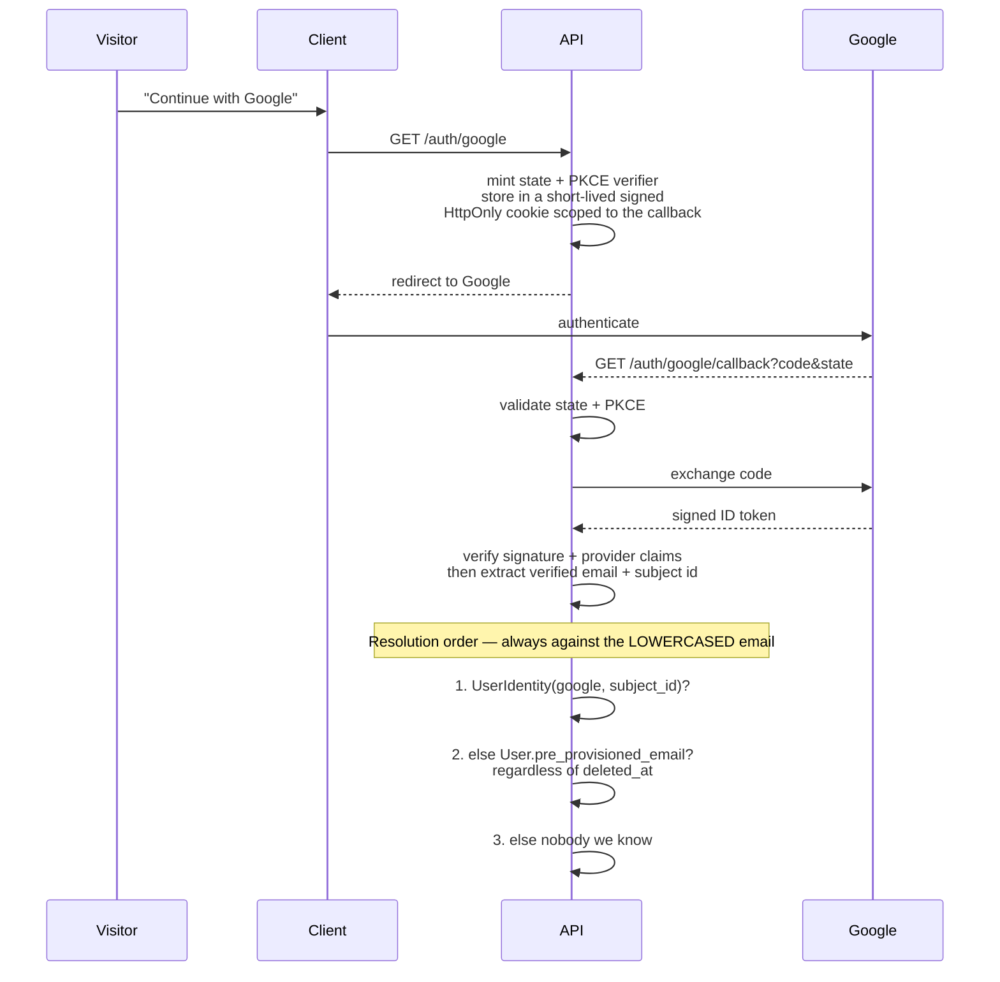
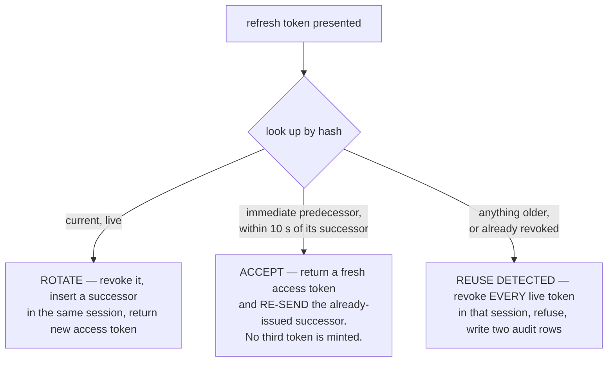

[Documentation](../README.md) › [Architecture](README.md) › **Identity and access**

# Identity and access

The part of the system with the most consequence if it is wrong. Read it before touching
anything that decides who may see what.

Four separable concerns, in the order a request meets them:

1. **[Authentication](#authentication)** — who is calling
2. **[Sessions](#sessions)** — how that survives across requests
3. **[Authorization](#authorization)** — what they may do
4. **[Child context](#child-context)** — whose data they may act on

---

## Authentication

**Google OAuth is the only identity provider.** No passwords, no hashes, no reset flows, no
password columns "for later". Minor students have no login identity at all.

The identity layer is **provider-abstracted** — a `UserIdentity` table keyed by provider and
subject id — specifically so local credentials can be added post-MVP without restructuring
`User`. That abstraction exists because the Google-only decision has a known cost
([Risk R-1](../overview/scope-and-roadmap.md#open-risks)).

### The onboarding sequence

**OAuth-first: the registration form is never shown before Google authentication
completes.** The verified email therefore always exists before any account data is
collected, and the email field on the form is pre-filled and read-only.



Then routing:

| Case | Action |
|---|---|
| **Identity exists** | Establish the session and route on the **complete** condition (below) |
| **Pre-provisioned match** | **Create and bind** the identity transactionally, then route by status. From here every later login resolves at step 1 |
| **Nobody we know** | Issue a short-lived onboarding token, redirect to the registration form |

### The Google identity trust boundary

The authorization-code exchange and ID-token validation are **two different security
steps**. TLS protects the server-to-server code exchange; it does not make an unverified
JWT payload an identity. The callback passes Google's `id_token` to the supported Google
Auth Library before it reads `sub` or `email`. The verifier requires an `RS256` protected
header with a non-empty provider key id, verifies the signature against Google's fetched
and cached signing certificates, and checks the token lifetime, the two documented Google
issuers, and this deployment's configured client id as the audience. Only then does the
application require a non-empty subject and email plus `email_verified = true`.

Malformed tokens, bad signatures, expired tokens, wrong issuer or audience, unknown keys,
and provider-certificate retrieval failures all fail closed as `oauth_unavailable` without
touching an account. A false or missing `email_verified` claim uses the SRS-specific
`email_unverified` redirect. Neither the token nor provider error details are logged.

This is a pure authorization-code flow (`response_type=code`), so the browser receives no
ID token in the authorization response. A nonce is therefore not added: the signed,
short-lived flow state binds the browser callback and PKCE binds the exchanged code, while
Google defines `nonce` as optional for this response type. If the flow ever changes to a
hybrid or implicit response that returns an ID token through the browser, that decision
must be revisited rather than copied forward.

### The routing condition, in full

```
account_status = Active     AND deleted_at IS NULL  → role dashboard
account_status = Pending    AND deleted_at IS NULL  → approval-status screen, zero data access
account_status ∈ {Rejected, Suspended} OR deleted_at IS NOT NULL
                                                    → "Account deactivated"
```

**Both terms are required.** Routing on `account_status` alone would hand a soft-deleted
user a dashboard, because a soft delete sets `deleted_at` without necessarily moving the
status.

This condition took two revisions to get right, and the bug it fixed is instructive. The
pre-provisioned lookup was originally scoped to `deleted_at IS NULL` — which is exactly what
made a deleted account **unreachable**, so it fell through to onboarding and the platform
would have offered **a deleted person the registration form**, contrary to the rule that
nothing silently re-registers. The scoping was removed and refusal became solely the
routing condition's job: **one rule instead of two half-rules** (Revision 20).

### The onboarding token

Short-lived (10 minutes), signed, single-use. It carries the verified email and subject id
from the callback to the form submission.

**The server extracts identity exclusively from the token payload.** Any email or OAuth
identifier in the request body is ignored entirely — the schema for that endpoint does not
even accept those fields, so a client cannot bind a different identity than the one Google
verified.

**Single-use is enforced mechanically.** Every token carries a unique `jti`; at submission
the `jti` is inserted into `ConsumedToken` **inside the registration transaction**, under a
unique constraint. A replayed token hits the violation, the transaction aborts, and the
request fails with `409`. Not a check — a constraint.

### Callback failures are redirects, never JSON

The callback is a browser redirect flow. Its failures never emit the API error envelope;
they redirect to `/login?error=<key>` and render as a friendly message with a retry:

`user_denied` · `state_mismatch` (also logged as a security event) · `oauth_unavailable` ·
`email_unverified` (hard stop, no account touched).

No partial state is ever persisted on any failure path.

### Email normalization

Every Google email is **lowercased before every lookup and every write** — identity
binding, pre-provision matching, the bootstrap comparison, persistence. The database
independently enforces lowercase storage with a `CHECK`, so a single unlowered code path
cannot create a case variant that slips past the unique index.

---

## Sessions

| Token | Lifetime | Transport |
|---|---|---|
| **Access** | 1 hour | `Authorization: Bearer` header — **never a cookie** |
| **Refresh** | 30 days | `HttpOnly; Secure; SameSite=Lax; Path=/api/v1/auth` cookie |

### The CSRF posture

Because the access token lives in a header and never in a cookie, **ordinary API mutations
are structurally immune to CSRF** — a cross-site attacker cannot set the header.

Exactly two routes consume the refresh cookie: `POST /auth/refresh` and
`POST /auth/logout`. Both require a custom header (`X-Requested-With`) and validate the
`Origin` against the configured public base URL **before reading the cookie**. Combined with
`SameSite=Lax`, that closes the remaining surface without a double-submit token system.
The browser manages the credential throughout; frontend JavaScript never receives it.

> **Same-origin routing is a delivery mechanism, not a security shield.** Never treat it as
> CSRF protection by itself.

### Rotation, and the three outcomes

Refresh tokens are stored **hashed, never raw** — a stolen database dump must not yield
usable 30-day credentials. The presented value is hashed and looked up against the unique
hash. Exactly three outcomes, decided by the predecessor pointer and the revocation flag:



Three details carry real weight:

**The grace window is idempotent.** It returns the *already-issued* successor rather than
minting a third token. Rotating there would **fork the chain into two live tokens, and a
forked chain makes reuse detection impossible.** The window exists to absorb the race
created by multiple browser tabs, which the client also mitigates with a single-flight
mutex — one in-flight refresh, concurrent callers awaiting its result.

**Refresh and logout serialize per rotation chain in PostgreSQL.** The presented hash first
identifies the server-owned `session_id`; the transaction then locks every token row in that
chain in deterministic issue order and re-reads the presented row before deciding. The first
read is discovery, never authority. This gives rotation and logout one linear order even when
one request read before the other acquired its lock: either rotation commits first and logout
revokes its successor, or logout commits first and rotation observes the revocation. A different
`session_id` locks a disjoint row set, so another browser session remains independent.

**Reuse ends the whole session.** A replayed rotated token is the signature of a stolen
cookie, so the response is to end the session, not to extend grace. Never accepted, never
resurrected.

**Every refusal looks identical.** Expired, revoked, unknown, purged, reuse-detected — all
answer `401` in the standard envelope. **No new error code was introduced**, deliberately:
telling the holder of a stolen cookie *why* it failed would confirm the token was once real.
The distinction is recorded in the audit log, not in the response.

Revoke-all exists as an internal capability — suspension and deletion use it — but **there
is no user-facing "log out everywhere" control**, no such route, and no such navigation
node. The capability exists because safeguarding requires it, not because a user invokes it.

### Logout: browser cleanup and server revocation are separate

`POST /auth/logout` identifies the current rotation chain from the HttpOnly refresh cookie,
revokes every live token carrying that `session_id`, writes `auth.logout` in the same
transaction, and only then returns the cookie expiry. A cookie disappearing from a browser is
not proof that its retained value is dead; the persisted revocation is the security property.
Another browser has another `session_id` and remains signed in.

The audit row is mandatory transaction state, not best-effort logging: if `auth.logout` cannot
be written, PostgreSQL rolls the revocation back and the endpoint does not expire the browser
cookie. No committed state may contain a logout revocation without its required audit row.

The endpoint stays idempotent: with a valid CSRF request context, an absent, unknown or
already-cleared cookie is `204`. A repeated browser logout therefore remains safe. Missing or
foreign CSRF context is `401` before the cookie is inspected.

Revision 101 changes the Path from `/api/v1/auth/refresh` to `/api/v1/auth`. The deployment
that introduces it stops the old API, atomically invalidates all live pre-cutover refresh
rows with `cookie_path_migration` plus system audit, applies the new code, and asks users to
authenticate again. Stopping the old issuer first is load-bearing: otherwise it could mint a
legacy narrow-path cookie after the one-time sweep.

### Freshness: where statelessness ends

An unexpired access token is **not sufficient authorization** for a defined set of
operations. Each of these asserts against the database, **per request**, that the caller is
still `Active` and still holds the invoked role and scope:

- Presigned URL minting
- Any read of a student's social profile
- Approval actions
- Consent-gate overrides and staff-recorded consent
- Pass/fail overrides
- User-management mutations

The reasoning is explicit: a teacher or admin suspended mid-session must lose access to
minors' case files and private recordings **immediately**, not at token expiry. A one-hour
stateless window is acceptable for reading your own schedule; it is not acceptable for
safeguarding-sensitive reads.

The assertion is one indexed read on low-frequency endpoints, so latency targets are
unaffected. Parent→child access is already fresh by construction — the link is checked on
every request anyway.

### JWT claims

```
sub            user id
roles[]        derived from role_scopes at issue time, so the two cannot disagree
role_scopes[]  one entry per role held: { role, branches }
               branches: null  ⇒  ALL branches for that assignment
account_status
iat / exp
```

**A flat `branch_scopes[]` is deliberately not a claim.** It cannot express "all branches",
and unioning scopes across roles extends one role's authority to another role's branches.

**No PII beyond these. No email in the token. The active child is never a claim.**

---

## Authorization

**Branch is the sole access-control axis.** Everything else is a capability.

A role assignment is `(user, role, branch)`, unique. The branch may be `NULL`, meaning **all
branches for that assignment** — not a Super Admin marker; Super Admin's bypass is a
property of its role.

### Scope resolves per role

```
capability granted by role R
   is constrained by the branches attached to R's OWN assignments
   — never by branches reaching the user through a different role
```

The failure this prevents is concrete: a Teacher in Casablanca who is also an Admin in
Marrakesh must not thereby administer Casablanca. The implementation resolved scope as a
flat union until Revision 24 caught it.

Related and equally concrete: `branch_id IS NULL` was documented as "unscoped (Super
Admin)" while the implementation derived an *empty* scope list from it — so an Admin
assigned to all branches could see **0 of 2**.

### Teachers reach students through groups only

A Teacher's role assignment carries the role, **not** their teaching reach. Exam authoring,
Quran logging, content upload, and case-file access all resolve **exclusively** through
group assignment. A teacher teaching Level 1 in Marrakesh and Level 2 in Casablanca is
expressed by two group assignments, because a group carries both level and branch.

### The permission matrix

Normative in TD-2, and it is **enforced server-side on every endpoint**. UI hiding is never
the enforcement mechanism.

A few rows worth knowing without opening the table:

- **Reference data** (branches, rooms, levels, categories, subjects, academic year,
  settings, display order, the Hijri calendar) — **Super Admin writes**. Admin reads within
  scope. **Teacher: no access at all** — they receive reference information through the
  operational APIs they are authorised to use (Revision 30).
- **Branch event backfill** stays an **Admin** capability, because it is operational work
  (populating events when a branch activates), not reference management.
- **Student social profile** — read *and* write for Super Admin, Admin in scope, and a
  Teacher for their own assigned students. **Never parents, never students.** Both reads
  and writes are audited.

> [Technical design § TD-2](../reference/technical-design.md#td-2) ·
> [Users and roles](../overview/users-and-roles.md)

### Routes are not the boundary

Permission checks live in services. The `/admin/*` prefix is **not** a permission boundary —
moving endpoints to `/superadmin/*` purely because of who may call them was rejected as
pointless churn.

---

## Who sees which branches

Viewing a branch is **not privileged** — but seeing branches you have nothing to
do with is noise at best and organisational detail at worst. So the list is
scoped, and the two staff roles derive their reach differently, because §4.2
forbids unioning roles into one flat scope:

| Role | Reaches |
|---|---|
| Super Admin | Every branch |
| Admin | The branches on their own `admin` assignments (`branches: null` = all, R24) |
| Teacher | **The branches of the schedules they staff** (§4.4c, R43.3) |
| Anyone else | Refused |

**A teacher's role row is deliberately not consulted.** A `teacher` assignment
with `branch_id IS NULL` means *every branch* under R24, so reading it would show
a teacher the whole organisation — the opposite of the rule. Reach is where they
teach, resolved by `teacherBranchIds`, which every other teacher surface already
uses.

An unassigned teacher therefore sees an **empty list**, which is the honest
answer rather than an error: they teach nowhere yet.

> **This closed a gap against R26, not a new rule.** R26 retained read access for
> *"Admins (branch-scoped) and **Teachers (own groups)**"*, and the guard demanded
> `isAdmin` — so every teacher was refused a list the specification grants them.
> A test asserted the refusal, pinning the implementation rather than the
> specification; it is corrected in place, with a note saying which it was,
> because a green test over wrong behaviour makes a defect look like a decision.

Rooms follow the branch through the same resolution. A branch out of reach
answers **`404`, never `403`** (§20 rule 17): a refusal would confirm the branch
exists to somebody with no business knowing.

**Writes are unchanged**: every create, edit and delete of a branch or room stays
Super Admin only (R26), and the screen itself is Super-Admin-only (R61).

## Active role

A person may hold several roles at once (§2.1), and the header carries an
**account switcher** for choosing between them.

**R60 made it a real authorization context.** It was a client-side context; it
is now a **JWT claim**, and a Super Admin working as مؤطِّرة genuinely loses
Super Admin authority until they switch back.

**Safety, not containment.** Switching back is self-service and instant, so this
cannot defend against a Super Admin who intends harm — and no design allowing
instant switching could. What it delivers is what it was approved for: testing
the platform exactly as another role experiences it, and an accidental click
while acting as مؤطِّرة that cannot delete a branch.

### How one claim narrows 103 call sites

Every authorization decision in the backend reads `Actor.roleScopes` — 103
references across 28 files, through five helpers in `branch-scope.ts`. When
`active_role` is present, `issueAccessToken` emits `role_scopes[]` **already
filtered to that one role**, and `roles[]` is derived from it, so both narrow
together.

Nothing downstream was edited. More importantly, nothing downstream *can*
consult an un-narrowed array, because none exists in that request.

```
narrowToRole(scopes, 'teacher')  →  [ { role: 'teacher', branches: [...] } ]
        ↓
isSuperAdmin(scopes) === false   →  refused at all 44 call sites
branchesForRole()                →  the Super Admin short-circuit stops applying
```

**§4.2 is untouched.** Scope still resolves per role; the array simply has one
entry, and that entry keeps its own `branches`, so a مؤطِّرة scoped to Marrakesh
stays scoped to Marrakesh.

### The two places that would have leaked

**TD-12 freshness** rebuilds roles from live rows and *ignores the token*. Left
alone it would have handed back full Super Admin authority on exactly the
endpoints TD-12 protects — everything narrowing except the most dangerous
surfaces. `assertFreshActive` now takes the active role, checks it is still
assigned, and returns scopes narrowed to it. This is the single largest risk the
revision carried, and `active-role.http.integration.test.ts` mutation-proves it:
reverting only that narrowing turns `/admin/settings` green for a teacher.

**`/me`** reads **live** rows rather than the token. Under an active role the
token carries one role, so reading the claim would leave the switcher a menu of
one — the person could narrow themselves and never widen again. `/me` answers
*what may this person become*; authorization answers *what is this person now*.

| Question | Answer |
|---|---|
| Where does it live? | The **JWT**, as `active_role` (R60). The client mirrors it in `contexts/active-role.tsx` |
| How is it persisted? | Not server-side at all — **no column on `User` or `RefreshToken`**. The claim is in the token, and the token is per-device |
| Does switching re-issue a token? | **Yes** — `POST /auth/switch-role`, one indexed query and one signature. No logout, no new session |
| What makes it survive a page load? | `POST /auth/refresh`. The client holds the token in memory and switching navigates by full page load, so **refresh is the load-bearing path**; it re-asserts the role and returns the one it granted |
| A revoked active role? | Refresh **falls back to the most privileged still-valid assignment** and says so — never a silent widening back to every role |
| Concurrent devices? | Different active roles by construction: two tokens, no shared state, nothing to reconcile |
| Can a person select a role they lack? | No. The list comes from `/me`, which is derived from the server-issued token, and `setActiveRole` refuses anything outside it |
| What happens on switch? | The context changes and the browser navigates to that role's home (`homeForRole`) |
| A role with no portal? | Every role §14.1 declares now has one. **`/dashboard/student` is built** (R62.10) and serves both the student's own record and, for a parent, the active child's. **`/dashboard/parent` is `not-found`** — R62 removed the screen, and the difference from `screen-pending` is the point: `screen-pending` promises a page that is coming |

### Why both the active role and the active child persist

Both live in **`sessionStorage`**, and for one reason: switching **navigates**,
which in this application is a full page load, so an in-memory selection would be
destroyed by the very navigation it causes.

The active child did *not* persist until R62, on the reasoning that a stale child
would silently change *whose data* a page requests after a link is revoked. R62
made that untenable rather than merely inconvenient — choosing a child now also
switches the active role, so the selection was lost by the action that made it.

**The staleness argument was answered, not dropped**, and by three independent
mechanisms rather than by a storage choice:

1. a revoked link is absent from the next `GET /me`, and `ActiveChildProvider`
   drops any stored id that is not in that list;
2. `localStorage` is still refused, so nothing survives the tab;
3. the server re-checks the approved `FamilyLink` on **every** request and
   answers `404` regardless of what the client believes (§4.3).

(1) is what makes the stored value safe: it is a *preference*, reconciled against
live authorization on every load, never a claim. Neither value is ever a token
claim — §4.3 is explicit that the active child must not be, so that revocation
takes effect on the very next request.

> **The defect this replaced.** `RoleSwitcher` held its selection in local
> component state and did nothing with it: picking a role re-labelled the trigger
> and changed nothing else. The control was documented as *"presentation only"*,
> and it was not even that. The old tests asserted that the switcher *appeared* —
> which it did — so nothing failed.

### The Trash is TD-12 fresh

Restore and permanent delete re-read the caller's roles from the database and
ignore the token (`assertFreshSuperAdmin`). A Super Admin whose role is revoked
would otherwise go on destroying records irreversibly until their access token
expired.

Found by probing, not by reading: `/admin/settings` already refused a validly
signed token claiming `super_admin` for a user who did not hold it, while
`/admin/trash` answered `200` to the identical request. Same platform, same
claim, two answers — and the weaker one guarded the deletions. The list read
takes the same check, because it is the one surface spanning every entity in
every branch (§5.6).

## Child context

The safeguarding gate. A parent acting for a minor asserts which child on **every** request.

```
X-Active-Child-ID: <child user id>
```

### Resolution, in order

| Situation | Behaviour |
|---|---|
| **Header present** | Verify an `Approved` family link matching **BOTH** the authenticated parent **AND** the header's child. Matching the child alone is a vulnerability |
| **Header absent + caller holds the Student role** | **Bypass entirely.** The acting student is the caller; ownership is verified against the token subject. Adult students never need and never send the header |
| **Header absent + caller is Parent-only** | `400` — the request is genuinely ambiguous without a child |

Every other failure — no such child, another parent's child, pending, rejected, deleted —
returns **`404`**, indistinguishable from each other and from a child that does not exist.

### Why per request

Because it makes revocation instant. Soft-deleting an approved link **is** the revocation
mechanism: the middleware re-checks the row on the very next call, and a deleted link is
already among the `404` conditions. No `Approved → Revoked` transition exists or should be
added — the enforcement is already complete.

The resolved acting-student id is what downstream policies and repositories receive. **They
never trust a student id from a request body or query string** for authorization.

Client-side context switching is presentation only. The header is an assertion; the server
decides.

> SRS §4.3 · [`BR-5`](../reference/business-rules.md#br-5) · §20 rule 6

---

## Bootstrapping the first administrator

A chicken-and-egg problem with a carefully specified answer.

`SUPER_ADMIN_EMAIL` is a **bootstrap configuration value, not an operational one.** The
seed consults it **only when no active Super Administrator exists**. Once one does, the
value is **ignored permanently** and may be removed from the environment entirely;
administrators are managed through the application, with the database as the single source
of truth.

The gate moved from "a row matching this email" to "an active Super Administrator exists"
because the original was idempotent only while the variable never changed: editing it and
re-running the seed matched nothing, created a **second** Super Admin, and left the previous
one active, privileged, and unclaimed — a silent privilege-retention bug, and the opposite
of what an operator editing that line intends.

Resolution when the gate is open:

1. The address already belongs to a non-deleted account (matched on **either** channel a
   verified address can occupy) → that account is **granted** the role, and set active if it
   is not, because bootstrap must yield a usable administrator.
2. Otherwise create the account with the address in `pre_provisioned_email`; its identity
   binds on first Google login. **No placeholder identity row is seeded.**
3. The address belongs to a **soft-deleted** account → **fail loudly, create nothing.**
   Guessing between resurrecting a deleted person and hijacking their address is not a
   decision a seed script may make.

**Lockout recovery is intended:** if every Super Administrator is suspended or deleted, the
gate reopens. This grants no new authority — running the seed already requires database
credentials and shell access to the VPS.

---

**Next:** [Security](security.md) · **Related:**
[Users and roles](../overview/users-and-roles.md), [API](api.md#authentication-semantics-decided-once)
