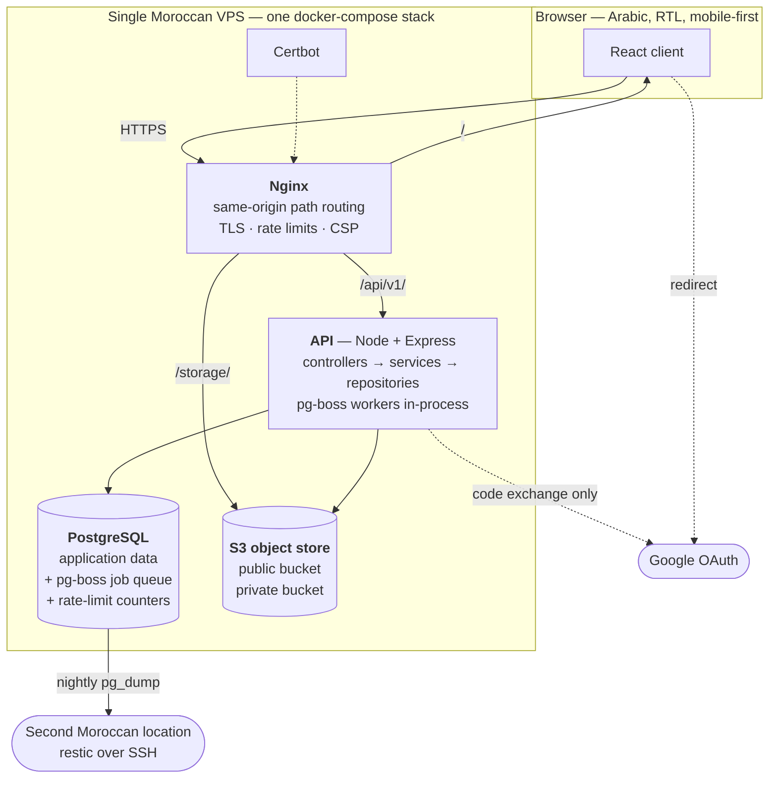

[Documentation](../README.md) › [Architecture](README.md) › **System overview**

# System overview

## The whole system, one diagram

- One origin: client, API and storage under one domain by path prefix; the refresh cookie is first-party on every call; no CORS allow-listing anywhere, in any environment.

## The request path

| Prefix | Serves | Notes |
|---|---|---|
| `/` | Static React bundle | gzip (brotli where available) |
| `/api/v1/` | Express API | `client_max_body_size 2m` |
| `/storage/` | Proxied to MinIO | `client_max_body_size 110m`, `proxy_request_buffering off` |
| `/healthz` | Component health | Public, unauthenticated, origin root |
| `/.well-known/acme-challenge/` | Certbot | TLS renewal |

- `client_max_body_size 110m` on `/storage/` only (Nginx default 1 MB → `413` before application code); `proxy_request_buffering off` avoids spooling bodies to disk (doubled I/O, disk-fill vector).
- Never raise the body limit globally; the API stays at 2 MB.

### The storage proxy, and signatures

- Presigned URLs are generated against the public storage origin so the signature matches what the browser sends through the proxy.
- `/storage/` strips the `/storage` prefix and rewrites `Host` consistently with the signed endpoint; any mismatch → `SignatureDoesNotMatch`.
- Signed PUT + signed GET through the proxy is a mandatory acceptance test; talking to MinIO directly proves nothing.

## Why one box

- ~900 users at launch, 5,000-user ceiling; single VPS is the correct architecture, binding per SRS §2.4.
- Do not introduce caching layers, read replicas, sharding, search engines or horizontal scaling.
- Do not die at the ceiling: every list paginated, every hot path index-backed, no unbounded scan or N+1; latency targets measured on ceiling-scale fixtures.
- Growth past the ceiling = separate deployment or deliberate re-architecture.

> [Performance and scale](performance-and-scale.md)

## Single-tenant, deliberately

- No tenant tables, `tenant_id` columns, token claims or tenant-scoped repository injection; the multi-tenant-ready design was removed (R11).
- A second institute = separate deployment (own VPS, database, MinIO, domain) or owner-approved re-architecture; speculative tenant columns prohibited.

## The technology, and why each piece

| Layer | Choice | Why |
|---|---|---|
| Runtime | Node.js 24.11.0, TypeScript 6.0.3 strict | One language client and server |
| API | Express 5.2.1 | Small, unopinionated; layering by convention |
| ORM | Prisma 7.9.0 (`@prisma/adapter-pg`) | Typed access, real migration history; limits worked around in [database](database.md#hand-written-sql) |
| Validation | Zod 4.4.3 | Field limits encoded once, shared with the client |
| Jobs | pg-boss 12.26.2 | Postgres-backed, no Redis container (4 GB box); jobs enqueued inside the triggering transaction |
| Database | PostgreSQL 18.4 | ICU collation for Arabic; partial and functional indexes; job queue and rate-limit counters |
| Storage | S3-compatible object store | Self-hosted SeaweedFS on Localhost, Staging, Production (Owner decision, 2026-09-20); pin, compatibility and residency in [Storage](storage.md#b1-candidate-verification-checkpoint) |
| Client | React 19.2.8 + Vite 8.1.5 | Fast static build; Next.js prohibited (server rendering breaks same-origin routing) |
| Edge | Nginx stable-alpine + Certbot | Same-origin routing, TLS, rate limits, error-page mapping |
| Tests | Vitest 4.1.11 | Unit and integration in one runner |

- Majors and minors locked; patch updates only, each in its own commit with a reason and a full CI run ([version policy](../development/conventions.md#versions)).

## Where the interesting logic actually is

Planned as full engineering effort, not scaffolding: Quran coverage interval-merge and its self-healing cache; grading engine basis-point invariants and recalculation (post-MVP); the auth/permission boundary (child-safeguarding gate, `X-Active-Child-ID` middleware, consent re-evaluation engine); the presigned-URL permission layer; dual calendar rendering.

## Data flow: one request, end to end

1. Nginx: TLS termination, per-IP rate limit, proxy to the API.
2. `requestContext`: assigns a request id carried into every log line and error body.
3. `authenticate`: verifies the token, `401` on any failure; `optionalAuthenticate` on public routes ignores an invalid credential and treats the caller as anonymous, never `401`.
4. Controller: parses and validates with Zod, calls exactly one service method.
5. Service: opens a transaction where needed, enforces the permission matrix and branch scope, validates the state transition, writes the audit row.
6. Repository: the only code touching Prisma; applies soft-delete filtering uniformly.
7. PostgreSQL constraints reject what the application missed.
8. `errorHandler` maps typed domain errors to the single error envelope.

Layering is [binding](../development/conventions.md#layering).

**Next:** [Backend](backend.md) · **Related:** [Identity and access](identity-and-access.md), [Deployment](../operations/deployment.md)
