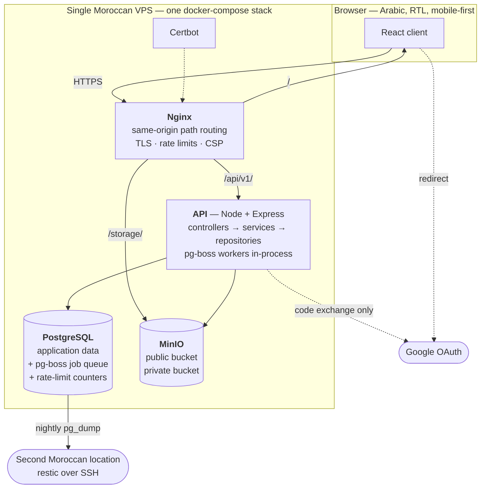

[Documentation](../README.md) › [Architecture](README.md) › **System overview**

# System overview

## The whole system, one diagram



**Everything is one origin.** The client, the API, and storage are served from a single
domain under different path prefixes. This is not a convenience — it is what makes the
refresh cookie first-party on every call, and it is why **no CORS allow-listing exists
anywhere, in any environment**.

## The request path

| Path prefix | Serves | Notes |
|---|---|---|
| `/` | The static React bundle | gzip (and brotli where available) for weak mobile links |
| `/api/v1/` | The Express API | `client_max_body_size 2m` |
| `/storage/` | Proxied to MinIO | `client_max_body_size 110m`, `proxy_request_buffering off` |
| `/healthz` | Component health | Public, unauthenticated, served at the origin root |
| `/.well-known/acme-challenge/` | Certbot | TLS renewal |

Two of those Nginx directives decide whether uploads work at all, and both are scoped to
`/storage/` only:

- **`client_max_body_size 110m`** — Nginx defaults to 1 MB. Without this, every recording
  upload dies with an Nginx-level `413` before it reaches any application code.
- **`proxy_request_buffering off`** — default buffering spools the entire body to Nginx's
  disk before forwarding. On a small VPS that is doubled disk I/O and a disk-fill vector.

**Never raise the body limit globally to "fix" uploads.** The API stays at 2 MB.

### The storage proxy, and signatures

Presigned URLs are generated against the **public** storage origin, so the signature matches
exactly what the browser sends through the proxy. The `/storage/` location must strip the
`/storage` prefix when forwarding and rewrite the `Host` header consistently with the
endpoint the signature was computed for. Any mismatch between signed host/path and proxied
host/path produces `SignatureDoesNotMatch`.

A signed PUT plus signed GET round-trip **through the proxy** is a mandatory acceptance
test. Verifying it by talking to MinIO directly proves nothing, because direct access is
the one path production never uses.

## Why one box

The platform is built for ~900 users at launch against a 5,000-user ceiling. At that scale
the single-VPS topology is **the correct architecture**, not a compromise — and the
specification says so as binding guidance.

**Do not introduce** caching layers, read replicas, sharding, search engines, or horizontal
scaling machinery. Premature optimization is a defect here.

**But do not write code that dies at the ceiling either**: every list is paginated, every
hot path is index-backed, and no endpoint performs an unbounded scan or an N+1 loop.
Latency targets are measured against **ceiling-scale fixture data**, not a ten-row
development database.

Growth past the ceiling means a separate deployment or a deliberate re-architecture — not
something MVP code should speculatively absorb.

> [Performance and scale](performance-and-scale.md) · SRS §2.4

## Single-tenant, deliberately

There is no tenancy dimension anywhere: no tenant tables, no `tenant_id` columns, no tenant
claim in a token, no tenant-scoped repository injection. An earlier revision carried a
multi-tenant-ready design and **Revision 11 removed it entirely**.

The trade-off is recorded rather than hidden. A second institute means a separate dedicated
deployment — its own VPS, database, MinIO, and domain, which the containerized pipeline
makes operationally cheap — or an owner-approved re-architecture. **Reintroducing tenant
columns speculatively is prohibited.**

## The technology, and why each piece

| Layer | Choice | Why this one |
|---|---|---|
| Runtime | **Node.js 24.11.0**, TypeScript 6.0.3 strict | One language across client and server |
| API | **Express 5.2.1** | Small, unopinionated; the layering discipline comes from conventions, not a framework |
| ORM | **Prisma 7.9.0** (`@prisma/adapter-pg`) | Typed access with a real migration history. Its limits are known and worked around explicitly ([database](database.md#hand-written-sql)) |
| Validation | **Zod 4.4.3** | One place where field limits are encoded, shared with the client |
| Jobs | **pg-boss 12.26.2** | Postgres-backed, so **no Redis container**. On a 4 GB box, container count is a real budget — and it is what lets a job be enqueued *inside* the transaction that triggers it |
| Database | **PostgreSQL 18.4** | ICU collation for correct Arabic sorting; partial and functional indexes; the job queue and rate-limit counters live here too |
| Storage | **S3-compatible object store** | Current implementation is self-hosted MinIO; Production requires the supported Moroccan-resident product chosen through the [storage decision](storage.md#owner-decision-required--object-store). A managed service is admissible only with written Moroccan primary/backup residency and acceptable contract controls |
| Client | **React 19.2.8** + **Vite 8.1.5** | Vite because the build is fast and the output is static. **Next.js is prohibited** — server-rendering would break the same-origin routing model |
| Edge | **Nginx** stable-alpine + Certbot | Same-origin routing, TLS, rate limits, error-page mapping |
| Tests | **Vitest 4.1.10** | Unit and integration in one runner |

Version majors and minors are **locked**. During active development only patch-level
updates are permitted, each in its own commit with a stated reason and a full CI run
([version policy](../development/conventions.md#version-policy)).

## Repository layout

```
backend/
  prisma/
    schema.prisma        the model
    migrations/          forward-only, incl. hand-written SQL
    seed/                production seed + development fixtures
  src/
    controllers/         HTTP only — no business logic
    services/            business logic, transactions, state machines
    repositories/        all database access — the single data-access layer
    policies/            permission and scope checks
    validators/          Zod schemas mirroring the validation limits
    middleware/          auth, child context, request id, error envelope
    jobs/                pg-boss handlers
    lib/                 storage, OAuth, tokens, config, hijri, pagination,
                         search normalization, display-name resolution
frontend/
  src/
    components/          shared registry + feature components
    pages/               one per sitemap node
    adapters/            API payload → view model
    contexts/            session, active child
    hooks/               navigation, data
    i18n/                ar catalog (fr/en post-MVP)
    styles/              tokens/ · base/ · components/
nginx/                   same-origin routing, TLS, rate limits, error pages
scripts/
  ci/                    the guard scripts CI runs
  dev/                   integration test runner, CSS resolver
docs/                    this documentation, and the specification
```

## Where the interesting logic actually is

AI-assisted development compresses CRUD scaffolding, migrations, and layout to hours. It
does **not** compress these, and they are planned as full engineering effort:

- The **Quran coverage interval-merge** calculation and its self-healing cache
- The **grading engine**'s basis-point invariants and recalculation lifecycle (post-MVP)
- The **auth and permission boundary** — especially the child-safeguarding gate, the
  `X-Active-Child-ID` middleware, and the consent re-evaluation engine
- The **presigned-URL permission layer**
- The **dual calendar** rendering

## Data flow: one request, end to end

```
Browser
  │  GET /api/v1/admin/groups?page=2   ·   Authorization: Bearer …
  ▼
Nginx ─ TLS termination, per-IP rate limit, proxy to the API
  ▼
requestContext ─ assigns a request id, carried into every log line and error body
  ▼
authenticate ─ verifies the token; 401 on any failure
  │             (optionalAuthenticate on public routes: an invalid credential
  │              is ignored and the caller is anonymous — never a 401)
  ▼
controller ─ parses and validates input with Zod, calls exactly one service method
  ▼
service ─ opens a transaction where the operation needs one,
  │        enforces the permission matrix and branch scope,
  │        validates the state transition, writes the audit row
  ▼
repository ─ the only code that touches Prisma;
  │           applies soft-delete filtering uniformly
  ▼
PostgreSQL ─ constraints reject anything the application layer missed
  │
  ▼
errorHandler ─ maps typed domain errors to the single error envelope
```

Each arrow is a boundary a reviewer will hold you to. The layering is
[binding](../development/conventions.md#layering), not stylistic.

---

**Next:** [Backend](backend.md) · **Related:** [Identity and access](identity-and-access.md),
[Deployment](../operations/deployment.md)
